# Context-Aware Image Captioning with Visual Genome Scene Graphs

## E25 Computer Vision - Final Project
## Niraj Thapaliya

---

## 1. Introduction

### Problem Statement

An ordinary image-captioning model looks at a picture and writes a sentence about
it. It usually learns a direct mapping from "pixels" straight to "words". That
works, but the model never really has an explicit notion of how the things in
the picture relate to each other, as it does not separately know that *the dog is
sitting on the surfboard*, as opposed to merely that a dog and a surfboard are
both somewhere in the frame.

The question we wish to ask is:

> If we hand a caption model an explicit "scene graph", ie the list of objects in
> the image plus their pairwise relationships (`subject -> predicate -> object`,
> e.g. `dog -> on -> surfboard`), does it write better, more relational captions
> than the same model working from the image alone?

A "scene graph" is just a structured summary of an image: nodes are objects (with
bounding boxes and labels) and edges are relationships. The
[Visual Genome](https://homes.cs.washington.edu/~ranjay/visualgenome/) dataset
provides exactly this, hand-annotated, for ~108k images.

### Notebook contents:

A rough summary of the sections in this notebook:

1. **Data preparation** — join Visual Genome scene graphs to COCO human captions,
   clean and filter the data, and build reproducible train/val/test splits.
2. **Exploratory data analysis** — image statistics, the long-tailed object and
   predicate distributions, and scene-graph visualisations.
3. **CV preprocessing** — contrast enhancement, sharpening, and
   geometric augmentation, with bounding boxes transformed in lock-step.
4. Two model architectures, trained / fine-tuned by us:
   - **Model A** — a single end-to-end network: a CNN image encoder + a
     scene-graph encoder feeding a Transformer caption decoder built from
     scratch.
   - **Model B** — a modular 3-stage pipeline: a fine-tuned YOLO object
     detector -> a graph neural network that predicts relationships -> the
     same caption decoder.
5. **Evaluation** - BLEU / ROUGE / METEOR, a controlled *with-graph vs.
   without-graph* ablation, hyperparameter comparisons, and qualitative examples
   on brand-new images.

### Short summary of results

(Further discussion is in "Conclusions")

- For Model A: giving the caption model a ready-made scene graph helps in a
  small but measurable way; captions come out better than the same model without
  it, and a statistical test confirms the gain is unlikely to be noise.

- For Model B: The full end-to-end model works as a captioner, but the results
  are not measurably better than the 'baseline' model from Model A (image-only
  version). A weakness of this approach is that each stage of the pipeline feeds
  into the next, and so strengthening the YOLO object detector model should be
  the first step towards improvement.


```python

```

## 2. Environment and configuration

We start by importing everything and fixing a single global configuration
object. Keeping all tunable constants in one `CFG` dataclass — rather than
scattering "magic numbers" through the notebook — makes the experiments below
easy to change and audit.


```python
import dataclasses
import json
import math
import multiprocessing
import os
import random
import re
import time
import warnings
from collections import Counter, defaultdict
from concurrent.futures import ThreadPoolExecutor
from pathlib import Path

import h5py
import matplotlib.pyplot as plt
import numpy as np
import pandas as pd
import skimage
import torch
import torch.nn as nn
import torch.nn.functional as F
import torchvision
from PIL import Image
from torch.utils.data import DataLoader, Dataset
```


```python
# Bugfix for Python 3.14
# Multiprocessing is weird inside jupyter notebooks
# Makes it difficult if writing code first as standalone
# python scripts and trying to port to jupyter.
try:
    multiprocessing.set_start_method("fork", force=True)
except (RuntimeError, ValueError):
    print("Cannot set multiprocessing 'fork' method!")
    pass

warnings.filterwarnings("ignore", category=UserWarning)
%config InlineBackend.figure_format = "retina"
plt.rcParams["figure.dpi"] = 110

DEVICE = torch.device("cuda" if torch.cuda.is_available() else "cpu")
print(f"torch {torch.__version__} | device: {DEVICE}")
if DEVICE.type == "cuda":
    print(
        f"GPU: {torch.cuda.get_device_name(0)} "
        f"({torch.cuda.get_device_properties(0).total_memory / 1e9:.1f} GB)"
    )
```

    torch 2.11.0+cu130 | device: cuda
    GPU: NVIDIA GeForce RTX 3060 Ti (8.2 GB)


```python
def set_seed(seed=42):
    random.seed(seed)
    np.random.seed(seed)
    torch.manual_seed(seed)
    torch.cuda.manual_seed_all(seed)


# This is for organization and being able to find all
# global variables easily
@dataclasses.dataclass
class CFG:
    data_dir: Path = Path("data")
    derived_dir: Path = Path("derived")
    image_dir: Path = Path("data/VG_100K")

    long_side: int = 512
    img_size: int = 224  # for resnet, later
    yolo_img_size: int = 512

    max_caption_len: int = 20
    min_word_freq: int = 5

    max_objects: int = 16
    max_relations: int = 16

    d_model: int = 256
    n_heads: int = 8
    n_decoder_layers: int = 3
    n_graph_layers: int = 2
    dropout: float = 0.1

    batch_size: int = 32
    lr: float = 3e-4
    weight_decay: float = 1e-4
    epochs_live: int = 3
    epochs_full: int = 15
    seed: int = 42

    def __post_init__(self):
        self.derived_dir.mkdir(exist_ok=True)
        (self.derived_dir / "cache").mkdir(exist_ok=True)
        (self.derived_dir / "checkpoints").mkdir(exist_ok=True)


cfg = CFG()
set_seed(cfg.seed)
cfg
```


    CFG(data_dir=PosixPath('data'), derived_dir=PosixPath('derived'), image_dir=PosixPath('data/VG_100K'), long_side=512, img_size=224, yolo_img_size=512, max_caption_len=20, min_word_freq=5, max_objects=16, max_relations=16, d_model=256, n_heads=8, n_decoder_layers=3, n_graph_layers=2, dropout=0.1, batch_size=32, lr=0.0003, weight_decay=0.0001, epochs_live=3, epochs_full=15, seed=42)


### Map of the two models

Below is a conceptual figure of what the two models look like.

Both models share the same caption decoder, they differ only in where the scene
graph comes from. Model A is handed the ground-truth graph from the training
data, and Model B has to predict the graph from pixels with a detector and a
graph network (trying to emulate a full end-to-end pipeline)


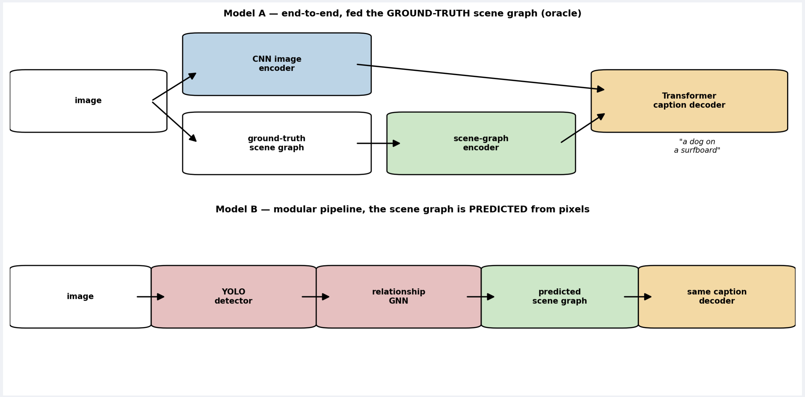


```python

```

## 3. Acquiring the data

This project combines three public sources. The cell below shows the script
I wrote for downloading and unzipping the data files, it should be run once
from the root of the project (where this notebook resides).

| Source | Data it contains | Size |
|---|---|---|
| Visual Genome images | the raw `.jpg` files (~108k images) | ~15 GB |
| VG150-curated (`VG-SGG.h5`, `VG-SGG-dicts.json`) | cleaned scene graphs: 150 object classes, 50 predicate classes | ~70 MB |
| `image_data.json` | maps Visual Genome image ids to COCO image ids and jpg files | ~20 MB |
| COCO 2014 captions | the human written captions we train the decoder against | ~280 MB |

### Why these particular sources?

I quickly learned after downloading the original Visual Genome annotations that
the data is quite noisy and redundant. After spending a lot of time trying to
deduplicate annotations and clean up the data, I found that other people had also
encountered this same problem, and that there already existed curated, tidy versions
of the Visual Genome annotaton dataset.

Rather than attempt to redo the work, I will use two cleaned-up iterations of the Visual
Genome annotations: "VG150" collapses the labels to the 150 most
frequent object classes and 50 predicate classes, and the "VG-curated" release
further prunes low-information edges. The result is a dataset that is
internally consistent much easier to work with.

Visual Genome images do not ship with whole-image captions, only with region
descriptions. For image captions, we use the captions from "COCO". There are
about 50,000 images in our total dataset of ~100k that are also COCO images, and
as long as we match them by image_id, we now can have a dataset of approx 50k images
that both have scene-graph information *and* human derived captions.

Setup script: to be run once to download data files from the internet
and unpack them into `data/`.

```bash
set -e
mkdir -p data

# VG150-curated scene graphs (H5 + label dictionaries)
wget -nc https://github.com/Maelic/VG_curated/raw/refs/heads/main/VG150_curated.zip -P data
unzip -u -d data data/VG150_curated.zip
cp -n data/no_part_whole/VG-SGG.h5 data/
cp -n data/no_part_whole/VG-SGG-dicts.json data/

# image_data.json (VG id <-> COCO id <-> jpg filename)
wget -nc https://github.com/KaihuaTang/Scene-Graph-Benchmark.pytorch/raw/refs/heads/master/datasets/vg/image_data.json -P data

# COCO 2014 caption annotations
wget -nc http://images.cocodataset.org/annotations/annotations_trainval2014.zip -P data
unzip -u -d data data/annotations_trainval2014.zip
cp -n data/annotations/captions_train2014.json data/
cp -n data/annotations/captions_val2014.json data/

# Visual Genome images (~15 GB, two zip parts)
wget -nc https://cs.stanford.edu/people/rak248/VG_100K_2/images.zip -P data
wget -nc https://cs.stanford.edu/people/rak248/VG_100K_2/images2.zip -P data
unzip -u -q -d data data/images.zip
unzip -u -q -d data data/images2.zip

# Consolidate both zip parts into one flat folder, data/VG_100K/
find data/VG_100K_2 -name '*.jpg' | xargs -J % mv % data/VG_100K/
rmdir -rf data/VG_100K_2
```


```python
n_images = len(list(cfg.image_dir.glob("*.jpg"))) if cfg.image_dir.is_dir() else 0
print(f"Visual Genome images on disk: {n_images:,}")
assert n_images > 100000, "Run the bash script above to get images"
```

    Visual Genome images on disk: 108,249


```python

```

## 4. Understanding the annotation files

Before we can model anything we have to understand the raw annotation format.
There are three relevant non-image files:

| File | Contents |
|---|---|
| `image_data.json` | one record per image: `image_id`, `width`, `height`, `coco_id`, `url` |
| `VG-SGG-dicts.json` | the label dictionaries: `idx_to_label` (150 objects), `idx_to_predicate` (50 predicates), plus class counts |
| `VG-SGG.h5` | the scene graphs themselves, stored as H5 datasets (arrays) |

The curated scene graphs are stored in a single HDF5 file as a set of flat,
index-aligned arrays rather than as per-image objects. This is compact but takes
a moment to decode. The key arrays:

- `boxes_512` / `boxes_1024` — `(N_boxes, 4)` bounding boxes as `[cx, cy, w, h]`
  in a coordinate frame where the image's long side is scaled to 512 / 1024 px.
- `labels` — `(N_boxes, 1)` object-class index (1–150) for each box.
- `relationships` — `(N_rels, 2)`; each row is `[subject_box_index, object_box_index]`
  pointing into the `boxes` arrays.
- `predicates` — `(N_rels, 1)` predicate-class index (1–50) for each relationship.
- `img_to_first_box` / `img_to_last_box` — for image `i`, its boxes are the
  contiguous slice `boxes[first : last + 1]` (or `-1` if the image has none).
- `img_to_first_rel` / `img_to_last_rel` — same idea for relationships.

Each row `i` of `VG-SGG.h5` corresponds to record `i` of `image_data.json`. We
can link data from the different sources (`.h5` files, `.json` files, COCO
annotations, using that shared index).


```python
image_data = json.load(open(cfg.data_dir / "image_data.json"))
image_df = pd.DataFrame.from_records(image_data)

vg_dicts = json.load(open(cfg.data_dir / "VG-SGG-dicts.json"))
idx_to_label = {int(k): v for k, v in vg_dicts["idx_to_label"].items()}
idx_to_predicate = {int(k): v for k, v in vg_dicts["idx_to_predicate"].items()}

h5 = h5py.File(cfg.data_dir / "VG-SGG.h5", "r")

print(f"image_data.json  : {len(image_data):,} image records")
print(
    f"object classes   : {len(idx_to_label)}   (e.g. {list(idx_to_label.values())[:5]})"
)
print(
    f"predicate classes: {len(idx_to_predicate)}   (e.g. {list(idx_to_predicate.values())[:5]})"
)
print()
print("VG-SGG.h5 arrays:")
for k in h5:
    print(f"  {k:20s} {str(h5[k].shape):16s} {h5[k].dtype}")
image_df.head()
```

    image_data.json  : 108,073 image records
    object classes   : 150   (e.g. ['air', 'airplane', 'animal', 'arm', 'back'])
    predicate classes: 50   (e.g. ['above', 'across', 'against', 'along', 'and'])

    VG-SGG.h5 arrays:
      boxes_1024           (1441984, 4)     int32
      boxes_512            (1441984, 4)     int32
      img_to_first_box     (108073,)        int32
      img_to_first_rel     (108073,)        int32
      img_to_last_box      (108073,)        int32
      img_to_last_rel      (108073,)        int32
      labels               (1441984, 1)     int64
      predicates           (636175, 1)      int64
      relationships        (636175, 2)      int32
      split                (108073,)        int32
      split_rel            (108073,)        int64


<div>
<style scoped>
    .dataframe tbody tr th:only-of-type {
        vertical-align: middle;
    }

    .dataframe tbody tr th {
        vertical-align: top;
    }

    .dataframe thead th {
        text-align: right;
    }
</style>
<table border="1" class="dataframe">
  <thead>
    <tr style="text-align: right;">
      <th></th>
      <th>width</th>
      <th>url</th>
      <th>height</th>
      <th>image_id</th>
      <th>coco_id</th>
      <th>flickr_id</th>
      <th>anti_prop</th>
    </tr>
  </thead>
  <tbody>
    <tr>
      <th>0</th>
      <td>800</td>
      <td>https://cs.stanford.edu/people/rak248/VG_100K_...</td>
      <td>600</td>
      <td>1</td>
      <td>NaN</td>
      <td>NaN</td>
      <td>0.000000</td>
    </tr>
    <tr>
      <th>1</th>
      <td>800</td>
      <td>https://cs.stanford.edu/people/rak248/VG_100K/...</td>
      <td>600</td>
      <td>2</td>
      <td>NaN</td>
      <td>NaN</td>
      <td>0.013408</td>
    </tr>
    <tr>
      <th>2</th>
      <td>640</td>
      <td>https://cs.stanford.edu/people/rak248/VG_100K/...</td>
      <td>480</td>
      <td>3</td>
      <td>NaN</td>
      <td>NaN</td>
      <td>0.022907</td>
    </tr>
    <tr>
      <th>3</th>
      <td>640</td>
      <td>https://cs.stanford.edu/people/rak248/VG_100K/...</td>
      <td>480</td>
      <td>4</td>
      <td>NaN</td>
      <td>NaN</td>
      <td>0.031527</td>
    </tr>
    <tr>
      <th>4</th>
      <td>800</td>
      <td>https://cs.stanford.edu/people/rak248/VG_100K/...</td>
      <td>600</td>
      <td>5</td>
      <td>NaN</td>
      <td>NaN</td>
      <td>0.011504</td>
    </tr>
  </tbody>
</table>
</div>


Now we wrap that flat layout in small, readable accessor classes. A `SceneGraph`
for image index `i` is the list of its `Obj`ects (box + label) and the list of
`Relation`s between them. Building these helpers once keeps every later
section — EDA, preprocessing, the dataloader — clean.


```python
H5 = {
    "boxes_512": h5["boxes_512"][:],
    "labels": h5["labels"][:, 0],
    "relationships": h5["relationships"][:],
    "predicates": h5["predicates"][:, 0],
    "img_to_first_box": h5["img_to_first_box"][:],
    "img_to_last_box": h5["img_to_last_box"][:],
    "img_to_first_rel": h5["img_to_first_rel"][:],
    "img_to_last_rel": h5["img_to_last_rel"][:],
}


@dataclasses.dataclass
class Obj:
    box_idx: int
    cx: float
    cy: float
    w: float
    h: float
    label_id: int
    label: str

    @property
    def xyxy(self):
        # Some of the plotting functions expect xyxy format, ie top-left to bottom-right pixel coordinates
        return (
            self.cx - self.w / 2,
            self.cy - self.h / 2,
            self.cx + self.w / 2,
            self.cy + self.h / 2,
        )


@dataclasses.dataclass
class Relation:
    subject: Obj
    predicate_id: int
    predicate: str
    object: Obj

    def __repr__(self):
        return f"{self.subject.label} - {self.predicate} - {self.object.label}"


def get_scene_graph(idx: int):
    fb = H5["img_to_first_box"][idx]
    lb = H5["img_to_last_box"][idx]

    objects = []
    box_idx_to_obj = {}

    if fb != -1:
        for b in range(fb, lb + 1):
            cx, cy, w, h = H5["boxes_512"][b].astype(float)
            lid = int(H5["labels"][b])
            o = Obj(b, cx, cy, w, h, lid, idx_to_label[lid])
            objects.append(o)
            box_idx_to_obj[b] = o

    relations = []
    fr, lr = H5["img_to_first_rel"][idx], H5["img_to_last_rel"][idx]
    if fr != -1:
        for r in range(fr, lr + 1):
            s_idx, o_idx = H5["relationships"][r]
            pid = int(H5["predicates"][r])
            # a few edges reference boxes outside the image's slice; skip them
            if s_idx in box_idx_to_obj and o_idx in box_idx_to_obj:
                relations.append(
                    Relation(
                        box_idx_to_obj[s_idx],
                        pid,
                        idx_to_predicate[pid],
                        box_idx_to_obj[o_idx],
                    )
                )
    return objects, relations


# Print an example
_objs, _rels = get_scene_graph(10)
print(
    f"Example: Image index 10 has {len(_objs)} objects and {len(_rels)} relationships."
)
print("First few relationships:")
for r in _rels[:5]:
    print("  ", r)
```

    Example: Image index 10 has 20 objects and 15 relationships.
    First few relationships:
       chair - at - table
       box - under - table
       cup - on - table
       box - under - table
       bowl - on - table


```python

```

## 5. Building the working dataset

We now turn the raw files into a clean, modelling-ready dataset. Three problems
to solve:

1. **Captions.** Visual Genome images have no whole-image captions. We join to
   COCO: for every VG image with a `coco_id`, collect that COCO image's
   (typically 5) human captions.
2. **Filtering.** We keep only images that have *all three* of: a COCO caption,
   ≥1 bounding box, and ≥1 relationship. An image with no relationships is
   useless for testing our central "does the scene graph help?" question.
3. **Splits.** We build reproducible, seeded train/val/test splits, plus nested
   *subset* splits (`tiny`, `small`, `medium`) so the notebook can train a quick
   demo run without touching the full dataset.


```python
# COCO ships captions in two files (train2014 / val2014). Each caption is
# {image_id, caption}. an image has ~5 of them. We build coco_id -> [captions].
def build_coco_caption_map():
    coco2caps = defaultdict(list)
    for fname in ["captions_train2014.json", "captions_val2014.json"]:
        coco = json.load(open(cfg.data_dir / fname))
        for ann in coco["annotations"]:
            coco2caps[ann["image_id"]].append(ann["caption"].strip())
    return coco2caps


coco2caps = build_coco_caption_map()
print(f"COCO images with captions: {len(coco2caps):,}")
```

    COCO images with captions: 123,287


```python
# filter to the usable intersection
# cached to disk because this step is a bit heavy
INDEX_PATH = cfg.derived_dir / "dataset_index.json"


def build_dataset_index():
    records = []
    for idx, item in enumerate(image_data):
        coco_id = item.get("coco_id")
        if coco_id is None or coco_id not in coco2caps:
            continue  # no caption
        if H5["img_to_first_box"][idx] == -1:
            continue  # no objects
        if H5["img_to_first_rel"][idx] == -1:
            continue  # no relations
        n_box = int(H5["img_to_last_box"][idx] - H5["img_to_first_box"][idx] + 1)
        n_rel = int(H5["img_to_last_rel"][idx] - H5["img_to_first_rel"][idx] + 1)
        records.append(
            {
                "vg_idx": idx,  # row index in image_data.json and VG-SGG.h5
                "image_id": item["image_id"],  # -> {image_id}.jpg on disk
                "coco_id": coco_id,
                "width": item["width"],
                "height": item["height"],
                "n_objects": n_box,
                "n_relations": n_rel,
                "captions": coco2caps[coco_id],
            }
        )
    return records


if INDEX_PATH.exists():
    dataset_index = json.load(open(INDEX_PATH))
    print(f"Loaded cached dataset index ({len(dataset_index):,} images).")
else:
    dataset_index = build_dataset_index()
    json.dump(dataset_index, open(INDEX_PATH, "w"))
    print(f"Built dataset index ({len(dataset_index):,} images) -> {INDEX_PATH}")

# drop any record whose jpg is somehow missing on disk
# there are a few corrupted images too
_before = len(dataset_index)
dataset_index = [
    r for r in dataset_index if (cfg.image_dir / f"{r['image_id']}.jpg").exists()
]
if len(dataset_index) != _before:
    print(f"Dropped {_before - len(dataset_index)} records with missing jpgs.")

index_df = pd.DataFrame(dataset_index)
print(
    f"\nFinal usable dataset: {len(index_df):,} images, "
    f"{index_df['n_objects'].sum():,} objects, "
    f"{index_df['n_relations'].sum():,} relationships."
)
index_df[["vg_idx", "image_id", "coco_id", "n_objects", "n_relations"]].head()
```

    Loaded cached dataset index (43,887 images).

    Final usable dataset: 43,887 images, 637,937 objects, 306,824 relationships.


<div>
<style scoped>
    .dataframe tbody tr th:only-of-type {
        vertical-align: middle;
    }

    .dataframe tbody tr th {
        vertical-align: top;
    }

    .dataframe thead th {
        text-align: right;
    }
</style>
<table border="1" class="dataframe">
  <thead>
    <tr style="text-align: right;">
      <th></th>
      <th>vg_idx</th>
      <th>image_id</th>
      <th>coco_id</th>
      <th>n_objects</th>
      <th>n_relations</th>
    </tr>
  </thead>
  <tbody>
    <tr>
      <th>0</th>
      <td>4999</td>
      <td>2415077</td>
      <td>111842</td>
      <td>11</td>
      <td>1</td>
    </tr>
    <tr>
      <th>1</th>
      <td>5002</td>
      <td>2415080</td>
      <td>100318</td>
      <td>12</td>
      <td>21</td>
    </tr>
    <tr>
      <th>2</th>
      <td>5004</td>
      <td>2415082</td>
      <td>127751</td>
      <td>14</td>
      <td>3</td>
    </tr>
    <tr>
      <th>3</th>
      <td>5011</td>
      <td>2415092</td>
      <td>175479</td>
      <td>15</td>
      <td>10</td>
    </tr>
    <tr>
      <th>4</th>
      <td>5014</td>
      <td>2415095</td>
      <td>456972</td>
      <td>7</td>
      <td>13</td>
    </tr>
  </tbody>
</table>
</div>


We find 43k usable images that both have COCO captions, objects, and relations, with
images present on disk


```python
# split the data
# 80/10/10 train/val/test on the 43k usable images
# also split into 'small' and 'full' type splits for ease of prototyping
# cache the split image_ids into 'splits.json' so we don't have to rerun
# this step every time the notebook is run
SPLITS_PATH = cfg.derived_dir / "splits.json"


def build_splits(n_total):
    # using the random seed from earlier
    rng = random.Random(cfg.seed)
    order = list(range(n_total))
    rng.shuffle(order)
    n_test = int(0.10 * n_total)
    n_val = int(0.10 * n_total)
    test = sorted(order[:n_test])
    val = sorted(order[n_test : n_test + n_val])
    train = sorted(order[n_test + n_val :])
    splits = {"train": train, "val": val, "test": test}
    for name, k in [("tiny", 200), ("small", 2000), ("medium", 12000)]:
        splits[f"train_{name}"] = sorted(train[:k])
    return splits


if SPLITS_PATH.exists():
    splits = json.load(open(SPLITS_PATH))
else:
    splits = build_splits(len(dataset_index))
    json.dump(splits, open(SPLITS_PATH, "w"))

for k, v in splits.items():
    print(f"  {k:14s} {len(v):>7,} images")
```

      train           35,111 images
      val              4,388 images
      test             4,388 images
      train_tiny         200 images
      train_small      2,000 images
      train_medium    12,000 images


```python

```

## 6. Exploratory data analysis

In the following section I show my exploration of the data in detail.

### Image dimensions

Visual Genome images come in many sizes and aspect ratios. The scene-graph
bounding boxes (`.h5` file), however, are stored in a fixed coordinate frame
where the **long side is scaled to 512 px**, which we'll address eventually.


```python
# Image geometry information
geom = index_df.copy()
geom["megapixels"] = geom["width"] * geom["height"] / 1e6
geom["aspect"] = geom["width"] / geom["height"]

fig, axs = plt.subplots(1, 3, figsize=(15, 4))
axs[0].hist(geom["megapixels"], bins=40, color="steelblue")
axs[0].set(title="Image size", xlabel="megapixels", ylabel="count")

axs[1].hist(geom["aspect"], bins=40, color="darkorange")
axs[1].axvline(1.0, color="k", ls="--", lw=1)
axs[1].set(title="Aspect ratio (w / h)", xlabel="aspect ratio", ylabel="count")

axs[2].scatter(geom["width"], geom["height"], s=2, alpha=0.15, color="seagreen")
axs[2].set(title="Width vs height", xlabel="width (px)", ylabel="height (px)")

fig.tight_layout()
plt.show()

print(geom[["width", "height", "megapixels", "aspect"]].describe().round(2))
```


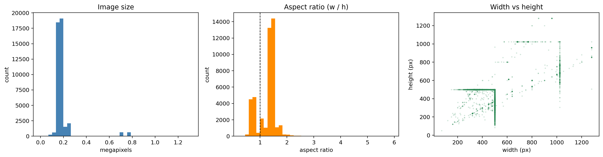


              width    height  megapixels    aspect
    count  43887.00  43887.00    43887.00  43887.00
    mean     487.12    404.45        0.20      1.27
    std      118.50    109.51        0.12      0.35
    min       72.00     51.00        0.00      0.30
    25%      500.00    333.00        0.17      1.00
    50%      500.00    375.00        0.18      1.33
    75%      500.00    500.00        0.19      1.50
    max     1280.00   1280.00        1.31      5.88


As you can see, most images sit around 0.2–0.5 MP and are mostly landscape
(median aspect ratio is ~1.3), with a long tail of very large images.

We will standardise everything to a 512 px long side for YOLO preprocessing, and
224px x 224px for the CNN later.

### Scene-graph density

How rich are the scene graphs? The following figures inform the decisions for
`max_objects` and `max_relations` in the config above, we want to cover the
majority of cases without while keeping these values as tight as possible for
ease of training and lower model parameters.


```python
fig, axs = plt.subplots(1, 2, figsize=(13, 4))
for ax, col, name, c in [
    (axs[0], "n_objects", "objects", "steelblue"),
    (axs[1], "n_relations", "relationships", "indianred"),
]:
    ax.hist(index_df[col], bins=range(0, int(index_df[col].max()) + 2), color=c)
    ax.axvline(
        index_df[col].median(),
        color="k",
        ls="--",
        lw=1,
        label=f"median = {index_df[col].median():.0f}",
    )
    ax.set(title=f"{name.capitalize()} per image", xlabel=f"# {name}", ylabel="count")
    ax.legend()
fig.tight_layout()
plt.show()

print(index_df[["n_objects", "n_relations"]].describe().round(2).T)
cov_o = (index_df["n_objects"] <= cfg.max_objects).mean()
cov_r = (index_df["n_relations"] <= cfg.max_relations).mean()
print(f"\ncfg.max_objects={cfg.max_objects} fully covers {cov_o:.1%} of images")
print(f"cfg.max_relations={cfg.max_relations} fully covers {cov_r:.1%} of images")
```


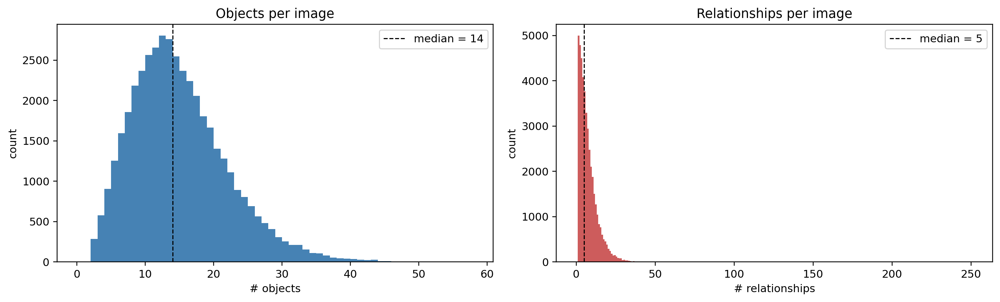


                   count   mean  std  min  25%   50%   75%    max
    n_objects    43887.0  14.54  7.0  2.0  9.0  14.0  19.0   57.0
    n_relations  43887.0   6.99  6.1  1.0  3.0   5.0   9.0  250.0

    cfg.max_objects=16 fully covers 66.0% of images
    cfg.max_relations=16 fully covers 93.1% of images


As you can see, images carry a median of ~12 objects and ~5 relationships.
Capping maximum objects and relationships at 16 fully cover the large majority
of images, with the rare denser graphs being truncated to their first 16 entries
rather than letting one outlier inflate every padded batch.

### Object and predicate class distributions

Both the object classes and the predicate classes are severely long-tailed: a
handful of classes (`on`, `has`, `man`, `tree`) dominate while dozens are
comparatively rare. This biases the model toward frequent classes, and it is why
later we (a) report macro-averaged metrics, not just accuracy, and (b)
experiment with class-weighted losses.


```python
def plot_long_tail(counts: dict, title: str, top_k: int, color: str):
    items = sorted(counts.items(), key=lambda kv: kv[1], reverse=True)
    names = [k for k, _ in items]
    vals = [v for _, v in items]
    fig, axs = plt.subplots(1, 2, figsize=(15, 4.5))
    axs[0].bar(range(len(vals)), vals, color=color)
    axs[0].set_yscale("log")
    axs[0].set(
        title=f"{title} — all {len(vals)} classes (log scale)",
        xlabel="class rank",
        ylabel="frequency",
    )
    axs[1].bar(names[:top_k], vals[:top_k], color=color)
    axs[1].set_xticks(range(top_k))
    axs[1].set_xticklabels(names[:top_k], rotation=60, ha="right", fontsize=8)
    axs[1].set(title=f"{title} — top {top_k}", ylabel="frequency")
    fig.tight_layout()
    plt.show()
    head = sum(vals[:top_k]) / sum(vals)
    print(
        f"  top {top_k} of {len(vals)} classes account for {head:.1%} of all instances"
    )


# count object + predicate instances over the usable subset only
obj_counts, pred_counts = Counter(), Counter()
for rec in dataset_index:
    objs, rels = get_scene_graph(rec["vg_idx"])
    for o in objs:
        obj_counts[o.label] += 1
    for r in rels:
        pred_counts[r.predicate] += 1

plot_long_tail(obj_counts, "Object classes", top_k=30, color="steelblue")
plot_long_tail(pred_counts, "Predicate classes", top_k=10, color="darkorange")
```


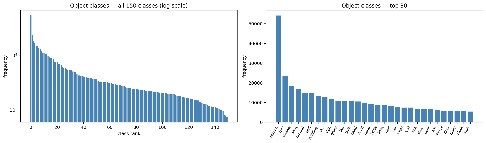


      top 30 of 150 classes account for 54.2% of all instances


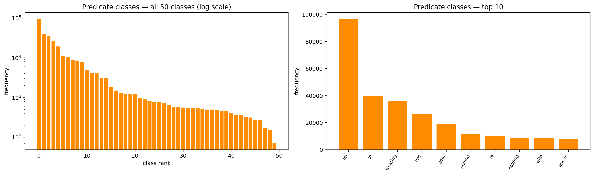


      top 10 of 50 classes account for 86.2% of all instances


The top 30 of 150 object classes and top 10 of 50 predicates cover the
overwhelming majority of instances. Predicates are especially skewed: spatial
relations like "on", "in" and "wearing" swamp everything else. I'll try to make
up for this during evaluation.

### The most common triplets

A scene-graph edge is a `(subject, predicate, object)` triplet. Looking at the
most frequent triplets tells us what relational structure the model can
realistically learn, and is useful information to know when designing
the scene graph model later.


```python
triplet_counts = Counter()
for rec in dataset_index:
    _, rels = get_scene_graph(rec["vg_idx"])
    for r in rels:
        triplet_counts[(r.subject.label, r.predicate, r.object.label)] += 1

top_triplets = triplet_counts.most_common(20)
trip_df = pd.DataFrame(
    [{"triplet": f"{s} -> {p} -> {o}", "count": c} for (s, p, o), c in top_triplets]
)
fig, ax = plt.subplots(figsize=(9, 6))
ax.barh(trip_df["triplet"][::-1], trip_df["count"][::-1], color="mediumpurple")
ax.set(title="20 most common scene-graph triplets", xlabel="frequency")
fig.tight_layout()
plt.show()
print(f"Distinct triplet types in the usable dataset: {len(triplet_counts):,}")
```


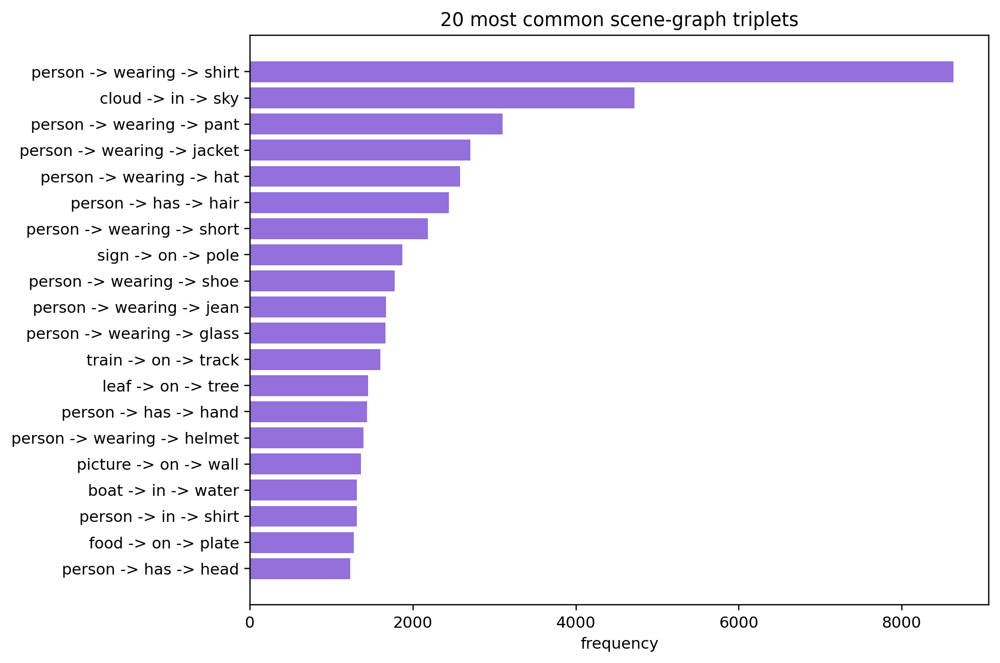


    Distinct triplet types in the usable dataset: 28,178


### Caption statistics

We need to know the average caption length (to estimate `max_caption_len`) and
vocabulary size. Text preprocessing is kept simple using by lowercasing,
stripping punctuation, and finally splitting on whitespace.


```python
def tokenize(caption: str):
    caption = caption.lower()
    caption = re.sub(r"[^a-z0-9 ]+", " ", caption)
    return caption.split()


# gather length + word stats over the TRAIN split
train_caps = [c for i in splits["train"] for c in dataset_index[i]["captions"]]
cap_lens = [len(tokenize(c)) for c in train_caps]
word_counter = Counter(w for c in train_caps for w in tokenize(c))

fig, axs = plt.subplots(1, 2, figsize=(13, 4))
axs[0].hist(cap_lens, bins=range(0, 35))
axs[0].axvline(
    cfg.max_caption_len - 2,
    color="k",
    ls="--",
    lw=1,
    label=f"cfg cap = {cfg.max_caption_len - 2} words",
)
axs[0].set(title="Caption length (train split)", xlabel="words", ylabel="count")
axs[0].legend()
top_words = word_counter.most_common(20)
axs[1].bar([w for w, _ in top_words], [c for _, c in top_words])
axs[1].set_xticklabels([w for w, _ in top_words], rotation=60, ha="right", fontsize=8)
axs[1].set(title="20 most frequent caption words", ylabel="frequency")
fig.tight_layout()
plt.show()

kept_vocab = [w for w, c in word_counter.items() if c >= cfg.min_word_freq]
print(f"Train captions          : {len(train_caps):,}")
print(
    f"Median caption length   : {np.median(cap_lens):.0f} words "
    f"(95th pct = {np.percentile(cap_lens, 95):.0f})"
)
print(f"Unique words            : {len(word_counter):,}")
print(
    f"Words kept (freq >= {cfg.min_word_freq})  : {len(kept_vocab):,}  "
    f"-> vocab incl. special tokens ~ {len(kept_vocab) + 4:,}"
)
```


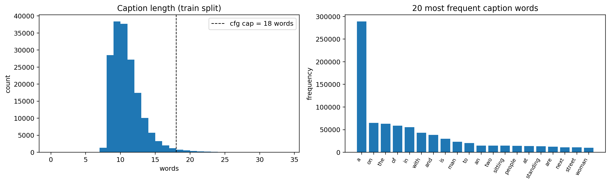


    Train captions          : 175,658
    Median caption length   : 10 words (95th pct = 15)
    Unique words            : 15,955
    Words kept (freq >= 5)  : 5,923  -> vocab incl. special tokens ~ 5,927


COCO captions are short and consistent — a median of ~10 words, 95% under 16 so `max_caption_len = 20` should be ok.

### Visualizing a scene graph

As an example of what the scene graph information looks like, we can draw a
few examples below including bounding boxes and arrows from "subject" to "object".


```python
from matplotlib.patches import FancyArrowPatch, Rectangle


def load_vg_image(rec):
    img = Image.open(cfg.image_dir / f"{rec['image_id']}.jpg").convert("RGB")
    w, h = img.size
    scale = cfg.long_side / max(w, h)
    return img.resize((round(w * scale), round(h * scale)))


def visualize_scene_graph(rec, ax=None):
    objs, rels = get_scene_graph(rec["vg_idx"])
    if ax is None:
        _, ax = plt.subplots(figsize=(8, 8))
    ax.imshow(load_vg_image(rec))
    for o in objs:
        x0, y0, x1, y1 = o.xyxy
        ax.add_patch(
            Rectangle((x0, y0), x1 - x0, y1 - y0, fill=False, edgecolor="lime", lw=1.2)
        )
        ax.text(
            x0,
            y0 - 2,
            o.label,
            fontsize=7,
            color="black",
            bbox=dict(facecolor="lime", alpha=0.7, pad=0.5, boxstyle="round"),
        )
    for r in rels:
        sx, sy = r.subject.cx, r.subject.cy
        ox, oy = r.object.cx, r.object.cy
        ax.add_patch(
            FancyArrowPatch(
                (sx, sy),
                (ox, oy),
                arrowstyle="-|>",
                mutation_scale=12,
                color="yellow",
                alpha=0.85,
                lw=1,
            )
        )
        ax.text(
            (sx + ox) / 2,
            (sy + oy) / 2,
            r.predicate,
            fontsize=6,
            color="black",
            ha="center",
            bbox=dict(facecolor="yellow", alpha=0.85, pad=0.4, boxstyle="round"),
        )
    ax.set_axis_off()
    return ax


set_seed(cfg.seed)
sample_recs = [dataset_index[i] for i in random.sample(splits["train"], 4)]
fig, axs = plt.subplots(2, 2, figsize=(15, 13))
for rec, ax in zip(sample_recs, axs.ravel()):
    visualize_scene_graph(rec, ax)
    ax.set_title(f'COCO caption: "{rec["captions"][0]}"', fontsize=9)
fig.tight_layout()
plt.show()
```


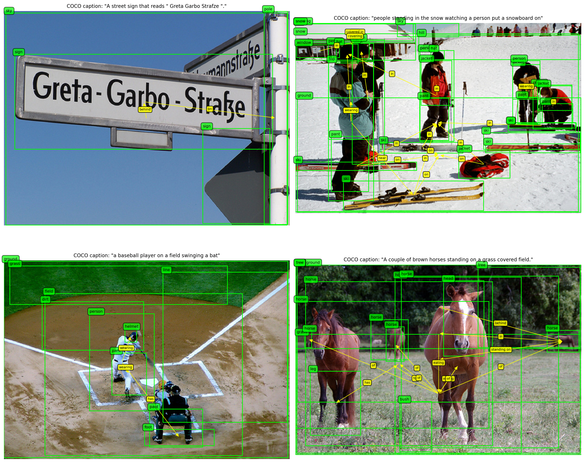


The curated annotations are clean and the green boxes and yellow relationship
arrows line up with the picture. The scene graph and the COCO caption are
complementary and not a 1:1 mapping: the graph enumerates objects and spatial
relations exhaustively, while the caption is selective and focused. The hope is
that the model can use the former to help produce the latter.


```python

```

## 7. Computer Vision preprocessing

This section covers the non-neural image processing: standardising geometry,
enhancing contrast, sharpening, and geometric augmentation. The recurring
challenge — and the reason this needs care — is that **every geometric operation
on the image must be applied identically to the bounding boxes**, or the scene
graph silently stops matching the picture.

### Geometry standardisation

The CNN encoder needs a fixed-size square input. We do this in two steps: resize
so the long side is 512 px (the box coordinate frame), then pad to a square and
resize to 224 px. We resize and pad rather than centre crop so that the VG150 box
coordinates work.


```python
def resize_and_pad(img, boxes, size=512):
    # Resize an image so its long side == size, then pad to a size x size square.
    # Transform the box coordinates accordingly
    w, h = img.size
    scale = size / max(w, h)
    new_w, new_h = round(w * scale), round(h * scale)
    img = img.resize((new_w, new_h))
    pad_x, pad_y = (size - new_w) // 2, (size - new_h) // 2
    canvas = Image.new("RGB", (size, size), (124, 116, 104))  # ImageNet-ish grey
    canvas.paste(img, (pad_x, pad_y))
    if len(boxes) == 0:
        return canvas, boxes
    boxes = boxes.astype(float).copy()
    box_scale = size / cfg.long_side  # boxes live in the long-side=512 frame
    boxes[:, [0, 2]] *= box_scale  # cx, w
    boxes[:, [1, 3]] *= box_scale  # cy, h
    boxes[:, 0] += pad_x
    boxes[:, 1] += pad_y
    return canvas, boxes
```

### Contrast enhancement and sharpening

Visual Genome is a web-scraped dataset: many images are dim, hazy, or soft. I
used two preprocessing steps to the 'raw' dataset:

- **CLAHE** (Contrast-Limited Adaptive Histogram Equalisation): equalises the
  histogram in local tiles, boosting local contrast without blowing out
  bright regions the way global equalisation does.
- **Unsharp masking**: sharpen by subtracting a blurred copy of the image from
  itself to amplify edges.

We can run these steps once on the dataset and be done. I still keep the 'raw'
images for comparision and save the preprocessed images to a new location.

Some examples below:


```python
from skimage import color as skcolor
from skimage import exposure, filters


def enhance_contrast(img, clip_limit=0.01):
    # CLAHE on the luminance channel only, so colours are not distorted
    arr = np.asarray(img) / 255.0
    lab = skcolor.rgb2lab(arr)
    lab[..., 0] = (
        exposure.equalize_adapthist(lab[..., 0] / 100.0, clip_limit=clip_limit) * 100.0
    )
    out = skcolor.lab2rgb(lab)
    return Image.fromarray((out * 255).clip(0, 255).astype(np.uint8))


def sharpen(img, amount=0.6, radius=1.5):
    # img + amount * (img - blur(img))
    arr = np.asarray(img).astype(float) / 255.0
    blurred = np.stack(
        [filters.gaussian(arr[..., c], sigma=radius) for c in range(3)], axis=-1
    )
    out = arr + amount * (arr - blurred)
    return Image.fromarray((out.clip(0, 1) * 255).astype(np.uint8))


# show examples
set_seed(cfg.seed + 123)
demo_recs = [dataset_index[i] for i in random.sample(splits["train"], 3)]
fig, axs = plt.subplots(3, 3, figsize=(13, 13))
for row, rec in enumerate(demo_recs):
    base = load_vg_image(rec)
    enhanced = enhance_contrast(base)
    sharpened = sharpen(enhanced)
    for col, (im, name) in enumerate(
        [
            (base, "original"),
            (enhanced, "+ CLAHE contrast"),
            (sharpened, "+ unsharp mask"),
        ]
    ):
        axs[row, col].imshow(im)
        axs[row, col].set_title(name, fontsize=9)
        axs[row, col].set_axis_off()
fig.tight_layout()
plt.show()
```


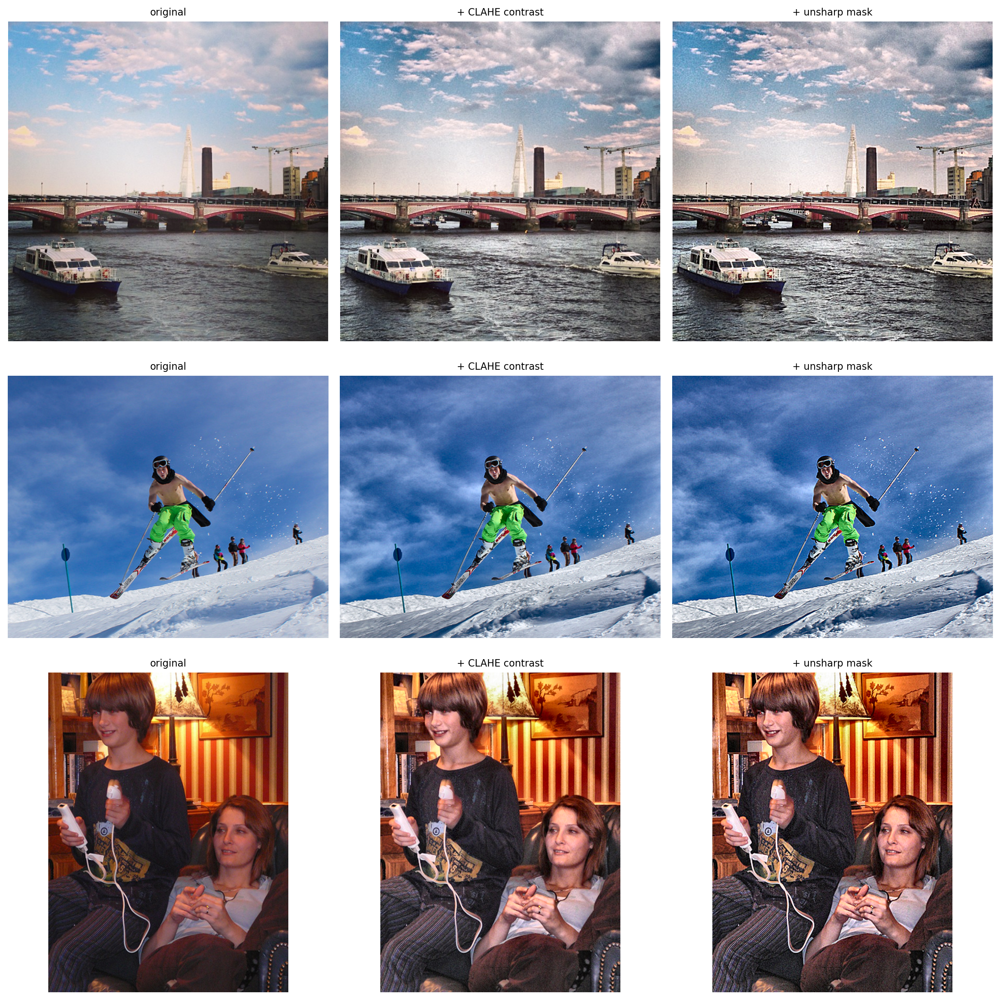


### Augmentation and synchronizing the bboxes

In order to apply augmentation such as random flip and translation+scale, we
need to transform the training data bounding boxes in the exact same way.
This took a little bit of elbow-grease to get working correctly, and below
you can see some examples of the (correctly) transformed bounding boxes.


```python
def aug_hflip(img, boxes, p=0.5):
    # Random horizontal flip, probability 0.5
    if random.random() > p:
        return img, boxes
    W = img.size[0]
    img = img.transpose(Image.FLIP_LEFT_RIGHT)
    if len(boxes) > 0:
        boxes = boxes.copy()
        boxes[:, 0] = W - boxes[:, 0]  # mirror cx; w, cy, h unchanged
    return img, boxes


def aug_affine(img, boxes, max_translate=0.08, max_scale=0.12):
    # Random translate + scale
    W, H = img.size
    tx = random.uniform(-max_translate, max_translate) * W
    ty = random.uniform(-max_translate, max_translate) * H
    s = 1.0 + random.uniform(-max_scale, max_scale)
    cx, cy = W / 2, H / 2
    a = 1 / s  # PIL wants the INVERSE map
    inv = (a, 0, (cx - a * cx) - tx * a, 0, a, (cy - a * cy) - ty * a)
    img = img.transform(
        (W, H), Image.AFFINE, inv, resample=Image.BILINEAR, fillcolor=(124, 116, 104)
    )
    if len(boxes) > 0:
        boxes = boxes.copy()
        boxes[:, 0] = (boxes[:, 0] - cx) * s + cx + tx  # cx
        boxes[:, 1] = (boxes[:, 1] - cy) * s + cy + ty  # cy
        boxes[:, 2] *= s  # w
        boxes[:, 3] *= s  # h
    return img, boxes


def _draw(ax, img, boxes, title):
    ax.imshow(img)
    for cx, cy, w, h in boxes:
        ax.add_patch(
            Rectangle(
                (cx - w / 2, cy - h / 2), w, h, fill=False, edgecolor="lime", lw=1.2
            )
        )
    ax.set_title(title, fontsize=9)
    ax.set_axis_off()


# examples
rec = demo_recs[1]
objs, _ = get_scene_graph(rec["vg_idx"])
boxes0 = np.array([[o.cx, o.cy, o.w, o.h] for o in objs], dtype=float)
img0, boxes0 = resize_and_pad(load_vg_image(rec), boxes0, cfg.img_size)

fig, axs = plt.subplots(1, 3, figsize=(14, 5))
_draw(axs[0], img0, boxes0, "standardised (resize + pad)")
_draw(axs[1], *aug_hflip(img0, boxes0, p=1.0), "horizontal flip")
_draw(axs[2], *aug_affine(img0, boxes0), "random affine jitter")
fig.tight_layout()
plt.show()
```


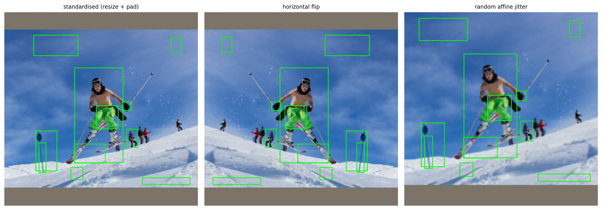


```python

```

## 8. Turning images, graphs and captions into tensors

We need to turn these PIL images, caption strings, and coordinates into PyTorch
Tensors. I create a custom `Vocab` class to tokenize caption strings to integer
tokens, and a custom `Dataset` subclass that synthesizes these varying types of
data and turns them into Tensors for consumption of our model.

### Caption vocabulary and tokenizer

First we need a "word level vocabulary" from the training captions only. Words
seen fewer than `cfg.min_word_freq` times collapse to `<unk>`. Four special
tokens are reserved: `<pad>` (id 0), `<bos>` / `<eos>` (beginning of sequence,
end of sequence), and `<unk>` (unknown). These are fairly common 'tokens' used
in NLP modeling tasks. We cache the computed values for use later on.


```python
PAD, BOS, EOS, UNK = "<pad>", "<bos>", "<eos>", "<unk>"


# Create custom Vocab class that encodes the captions to tokens
class Vocab:
    def __init__(self, itos):
        self.itos = list(itos)
        self.stoi = {w: i for i, w in enumerate(self.itos)}

        self.pad_id = self.stoi[PAD]
        self.bos_id = self.stoi[BOS]
        self.eos_id = self.stoi[EOS]
        self.unk_id = self.stoi[UNK]

    def __len__(self):
        return len(self.itos)

    def encode(self, caption, max_len=cfg.max_caption_len):
        toks = tokenize(caption)[: max_len - 2]
        ids = (
            [self.bos_id]
            + [self.stoi.get(t, self.unk_id) for t in toks]
            + [self.eos_id]
        )
        ids += [self.pad_id] * (max_len - len(ids))
        return ids

    def decode(self, ids):
        words = []
        for i in ids:
            i = int(i)
            if i == self.eos_id:
                break
            if i not in (self.pad_id, self.bos_id):
                words.append(self.itos[i])
        return " ".join(words)

    def save(self, path):
        json.dump(self.itos, open(path, "w"))

    @classmethod
    def load(cls, path):
        return cls(json.load(open(path)))


VOCAB_PATH = cfg.derived_dir / "vocab.json"
if VOCAB_PATH.exists():
    vocab = Vocab.load(VOCAB_PATH)
else:
    kept = sorted(w for w, c in word_counter.items() if c >= cfg.min_word_freq)
    vocab = Vocab([PAD, BOS, EOS, UNK] + kept)
    vocab.save(VOCAB_PATH)

print(f"Vocabulary size: {len(vocab):,} tokens")
_demo = "A grey dog is sitting on a kayak in the ocean"
print(f'encode("{_demo}")')
print("  ->", vocab.encode(_demo))
print("  -> decode ->", repr(vocab.decode(vocab.encode(_demo))))
```

    Vocabulary size: 5,927 tokens
    encode("A grey dog is sitting on a kayak in the ocean")
      -> [1, 33, 2257, 1539, 2640, 4654, 3446, 33, 2706, 2567, 5260, 3423, 2, 0, 0, 0, 0, 0, 0, 0]
      -> decode -> 'a grey dog is sitting on a kayak in the ocean'


### Encoding a scene graph as tensors

Each image's scene graph becomes a small bundle of tensors:

- **objects** — up to `max_objects`, each represented by its class id and its box `(cx, cy, w, h)` normalized to between 0 and 1.
- **relations** — up to `max_relations` edges, each a triple of
  `(subject_id, predicate_id, object_id)` where the subject/object id indices point into the object list above.


```python
def transform_boxes_to_proc(boxes_512, orig_w, orig_h, target=cfg.img_size):
    # Transform boxes from dataset that are scaled to 512px on the long size
    # to normalized boxes with values between [0,1], rlative to origina image dims
    # pad to target dimension (square)
    if len(boxes_512) == 0:
        return boxes_512

    # Scaling factor
    s512 = cfg.long_side / max(orig_w, orig_h)
    # Width scale, height scale
    w512, h512 = round(orig_w * s512), round(orig_h * s512)
    scale = target / max(w512, h512)
    new_w, new_h = round(w512 * scale), round(h512 * scale)

    pad_x, pad_y = (target - new_w) // 2, (target - new_h) // 2

    # normalize
    box_scale = target / cfg.long_side
    b = np.asarray(boxes_512, dtype=float).copy()

    # scale widths
    b[:, [0, 2]] *= box_scale

    # scale heights
    b[:, [1, 3]] *= box_scale

    # add pad
    b[:, 0] += pad_x
    b[:, 1] += pad_y
    return b


def encode_scene_graph(objs, rels, boxes_proc):
    n_obj = min(len(objs), cfg.max_objects)
    obj_labels = torch.zeros(cfg.max_objects, dtype=torch.long)
    obj_boxes = torch.zeros(cfg.max_objects, 4, dtype=torch.float)
    obj_mask = torch.zeros(cfg.max_objects, dtype=torch.bool)
    box_idx_to_slot = {}
    for slot in range(n_obj):
        o = objs[slot]
        obj_labels[slot] = o.label_id  # 1..150 (0 = pad)
        obj_boxes[slot] = torch.tensor(boxes_proc[slot]) / cfg.img_size  # -> [0,1]
        obj_mask[slot] = True
        box_idx_to_slot[o.box_idx] = slot

    rel_subj = torch.zeros(cfg.max_relations, dtype=torch.long)
    rel_pred = torch.zeros(cfg.max_relations, dtype=torch.long)
    rel_obj = torch.zeros(cfg.max_relations, dtype=torch.long)
    rel_mask = torch.zeros(cfg.max_relations, dtype=torch.bool)
    slot = 0
    for r in rels:
        if slot >= cfg.max_relations:
            break
        s = box_idx_to_slot.get(r.subject.box_idx)
        o = box_idx_to_slot.get(r.object.box_idx)
        if s is None or o is None:  # endpoint truncated by max_objects
            continue
        rel_subj[slot], rel_pred[slot], rel_obj[slot] = s, r.predicate_id, o
        rel_mask[slot] = True
        slot += 1
    return {
        "obj_labels": obj_labels,
        "obj_boxes": obj_boxes,
        "obj_mask": obj_mask,
        "rel_subj": rel_subj,
        "rel_pred": rel_pred,
        "rel_obj": rel_obj,
        "rel_mask": rel_mask,
    }


# TODO: print an example of what this looks like, .shape for each object
```

### Caching preprocessed images

The preprocessing steps mentioned earlier (histogram equalization and unsharp
mask) are cached to disk so as to not have to redo the work every iteration.

The following code is a one-time preprocessing step on all the eligible images.


```python
PROC_DIR = cfg.derived_dir / "proc"
PROC_DIR.mkdir(exist_ok=True)


def _preprocess_one(rec):
    out_path = PROC_DIR / f"{rec['image_id']}.jpg"
    if out_path.exists():
        return
    img = Image.open(cfg.image_dir / f"{rec['image_id']}.jpg").convert("RGB")
    w, h = img.size
    img = img.resize(
        (round(w * cfg.long_side / max(w, h)), round(h * cfg.long_side / max(w, h)))
    )
    img = enhance_contrast(img)
    img = sharpen(img, amount=0.6)
    img, _ = resize_and_pad(img, np.empty((0, 4)), cfg.img_size)

    # TODO: quality 92 is arbitrary, maybe lower it?
    img.save(out_path, quality=92)


_todo = [r for r in dataset_index if not (PROC_DIR / f"{r['image_id']}.jpg").exists()]
if _todo:
    from tqdm.auto import tqdm

    print(
        f"Preprocessing {len(_todo):,} images (one-time, ~{len(_todo) * 0.02 / 60:.0f} min)..."
    )
    # multiprocessing is wonky inside jupyter notebooks...
    with ThreadPoolExecutor(max_workers=8) as ex:
        list(tqdm(ex.map(_preprocess_one, _todo), total=len(_todo)))
else:
    print(f"All {len(dataset_index):,} images already preprocessed -> {PROC_DIR}")
```

    All 43,887 images already preprocessed -> derived/proc


### The PyTorch `Dataset` and `DataLoader`

Finally we wrap everything in a `Dataset`. Each item returns the standardised
image tensor, the scene-graph tensor bundle, and a caption (one of the image's
~5 COCO captions, sampled at random during training as a light text
augmentation). For validation/test we also pass the full list of reference
captions, to help with metric evaluatation (predicted/ground truth comparisions).


```python
# https://stackoverflow.com/questions/58151507/why-pytorch-officially-use-mean-0-485-0-456-0-406-and-std-0-229-0-224-0-2
IMAGENET_MEAN = torch.tensor([0.485, 0.456, 0.406]).view(3, 1, 1)
IMAGENET_STD = torch.tensor([0.229, 0.224, 0.225]).view(3, 1, 1)


def to_tensor_norm(img):
    # input is PIL image, each pixel value is a uint 0 to 255
    # convert to float between 0..1
    # channel is moved to front
    t = torch.from_numpy(np.asarray(img, dtype=np.float32) / 255.0).permute(2, 0, 1)
    return (t - IMAGENET_MEAN) / IMAGENET_STD


class VGCaptionDataset(Dataset):
    def __init__(self, split_indices, train, proc_dir=None, augment=None):
        self.recs = [dataset_index[i] for i in split_indices]
        self.train = train
        self.proc_dir = proc_dir if proc_dir is not None else PROC_DIR
        self.augment = train if augment is None else augment

    def __len__(self):
        return len(self.recs)

    # returns (image tensor, scene-graph bundle, caption ids, references)
    # image index i -> image_json[i]['image_id']
    def __getitem__(self, i):
        rec = self.recs[i]

        # processed image location proc_dir
        img = Image.open(self.proc_dir / f"{rec['image_id']}.jpg").convert("RGB")
        objs, rels = get_scene_graph(rec["vg_idx"])
        boxes_512 = np.array([[o.cx, o.cy, o.w, o.h] for o in objs], dtype=float)
        boxes_proc = transform_boxes_to_proc(boxes_512, rec["width"], rec["height"])

        # random augmentation for train
        if self.augment:
            img, boxes_proc = aug_hflip(img, boxes_proc, p=0.5)
            img, boxes_proc = aug_affine(img, boxes_proc)
        sg = encode_scene_graph(objs, rels, boxes_proc)
        # take one random caption
        # can we 'average' the 5 captions? TODO
        caps = rec["captions"]
        chosen = random.choice(caps) if self.train else caps[0]
        cap_ids = torch.tensor(
            vocab.encode(chosen, cfg.max_caption_len), dtype=torch.long
        )
        return {
            "image": to_tensor_norm(img),
            **sg,
            "caption": cap_ids,
            "references": caps,
            "vg_idx": rec["vg_idx"],
        }


def custom_collate(batch):
    # stack tensors
    # concatenate lists
    out = {}
    for k in batch[0]:
        if isinstance(batch[0][k], torch.Tensor):
            out[k] = torch.stack([b[k] for b in batch])
        else:
            out[k] = [b[k] for b in batch]
    return out


def make_loader(split_name, train, proc_dir=None, augment=None):
    ds = VGCaptionDataset(
        splits[split_name], train=train, proc_dir=proc_dir, augment=augment
    )
    return DataLoader(
        ds,
        batch_size=cfg.batch_size,
        shuffle=train,
        num_workers=4,
        collate_fn=custom_collate,
        drop_last=train,
        pin_memory=(DEVICE.type == "cuda"),
    )


# print example batch
_loader = make_loader("train_tiny", train=True)
_batch = next(iter(_loader))
print("Batch tensor shapes:")
for k, v in _batch.items():
    if isinstance(v, torch.Tensor):
        print(f"  {k:12s} {tuple(v.shape)}  {v.dtype}")
    else:
        print(f"  {k:12s} list[{len(v)}]")
print(f'\nExample caption decoded: "{vocab.decode(_batch["caption"][0])}"')
print(
    f"Objects in item 0: {_batch['obj_mask'][0].sum().item()}, "
    f"relations: {_batch['rel_mask'][0].sum().item()}"
)
```

    Batch tensor shapes:
      image        (32, 3, 224, 224)  torch.float32
      obj_labels   (32, 16)  torch.int64
      obj_boxes    (32, 16, 4)  torch.float32
      obj_mask     (32, 16)  torch.bool
      rel_subj     (32, 16)  torch.int64
      rel_pred     (32, 16)  torch.int64
      rel_obj      (32, 16)  torch.int64
      rel_mask     (32, 16)  torch.bool
      caption      (32, 20)  torch.int64
      references   list[32]
      vg_idx       list[32]

    Example caption decoded: "a man looking at sandwiches in a deli"
    Objects in item 0: 4, relations: 2


```python

```

## 9. Model A — an end-to-end vision + scene graph caption decoder

Model A is a single network trained end-to-end. It has three parts, all sharing
a common hidden width `d_model`:

1. **Image encoder** — a pretrained ResNet-50 backbone used as a feature
   extractor, with the heavy lower layers frozen) turns the image into a grid of
   7×7 = 49 region feature vectors.
2. **Scene graph encoder** — embeds the object classes, their boxes, and the
   predicate edges, then mixes them with a small Transformer encoder into a set
   of graph "context" vectors.
3. **Caption decoder** — a Transformer decoder we build from scratch. It
   generates the caption one word at a time, cross-attending to both the image
   regions and the graph context.

In order to answer the research question in the introduction, we need to be
able to compare the performance of this model with and without scene graph
information. The caption decoder model includes a `use_graph` flag: if it's
True then it takes both scene graph information and image feature vectors. If
it's False, then only image feature vectors are passed in, with the SG
vectors replaced with zeros. This way we can compare the same architecture
with and without scene graph information and see if including that info
makes any difference to the end result or not.

It is not very complicated conceptually, but the real difficulty for me was
wrangling the differing vector output sizes and keeping track of them, as
well as projecting them so that the next layer accepts them.

### Image encoder


```python
class ImageEncoder(nn.Module):
    # frozen Resnet50 backbone
    # with an option to unfreeze last block
    def __init__(self, d_model, unfreeze_last_block=True):
        super().__init__()
        net = torchvision.models.resnet50(
            weights=torchvision.models.ResNet50_Weights.IMAGENET1K_V2
        )
        self.backbone = nn.Sequential(*list(net.children())[:-2])
        for p in self.backbone.parameters():
            p.requires_grad = False
        if unfreeze_last_block:
            for p in self.backbone[-1].parameters():
                p.requires_grad = True

        # Resnet vectors (not including classification head) are (2048,7,7) in width
        self.proj = nn.Conv2d(2048, d_model, kernel_size=1)
        self.norm = nn.LayerNorm(d_model)

    # Project to `d_model`, which we define below
    def forward(self, images):
        feat = self.backbone(images)  # (batch, 2048, 7, 7)
        feat = self.proj(feat)  # (batch, d_model, 7, 7)
        feat = feat.flatten(2).transpose(1, 2)  # (batch, 49, d_model)
        return self.norm(feat)
```

### Scene graph encoder

The graph encoder turns the tensor bundle from Section 8.2 into a sequence of
context vectors. Objects become nodes (class embedding + a projection of their
box geometry); relationships become extra tokens built from their subject
feature, predicate embedding, and object feature. A small Transformer encoder
then lets nodes and edges exchange information. We expose the object and relation
**padding masks** so the decoder never attends to padding slots.


```python
class SceneGraphEncoder(nn.Module):
    """Scene-graph tensor bundle -> (B, max_objects + max_relations, d_model)
    sequence of context vectors, plus a key-padding mask."""

    def __init__(self, d_model, n_layers, n_heads, dropout):
        super().__init__()
        self.obj_embed = nn.Embedding(151, d_model, padding_idx=0)  # 150 classes + pad
        self.pred_embed = nn.Embedding(
            51, d_model, padding_idx=0
        )  # 50 predicates + pad
        self.box_proj = nn.Linear(4, d_model)
        # a relation token is built from [subject ; predicate ; object] features
        self.rel_proj = nn.Linear(3 * d_model, d_model)
        # learned type embeddings so the encoder can tell objects from relations
        self.type_embed = nn.Embedding(2, d_model)
        layer = nn.TransformerEncoderLayer(
            d_model,
            n_heads,
            dim_feedforward=4 * d_model,
            dropout=dropout,
            batch_first=True,
            activation="gelu",
        )
        self.encoder = nn.TransformerEncoder(layer, n_layers)
        self.norm = nn.LayerNorm(d_model)

    def forward(self, b):
        # --- object node features: class embedding + box geometry
        obj_feat = self.obj_embed(b["obj_labels"]) + self.box_proj(b["obj_boxes"])
        obj_feat = obj_feat + self.type_embed.weight[0]

        # --- relation token features: gather subject/object node features by slot
        idx = torch.arange(obj_feat.size(0), device=obj_feat.device).unsqueeze(1)
        subj_feat = obj_feat[idx, b["rel_subj"]]  # (B, max_rel, d_model)
        objt_feat = obj_feat[idx, b["rel_obj"]]
        pred_feat = self.pred_embed(b["rel_pred"])
        rel_feat = self.rel_proj(torch.cat([subj_feat, pred_feat, objt_feat], dim=-1))
        rel_feat = rel_feat + self.type_embed.weight[1]

        # --- concatenate nodes + edges into one sequence, build the padding mask
        seq = torch.cat([obj_feat, rel_feat], dim=1)  # (B, O+R, d_model)
        mask = torch.cat([b["obj_mask"], b["rel_mask"]], dim=1)  # True where REAL
        key_padding_mask = ~mask  # True where PAD
        seq = self.encoder(seq, src_key_padding_mask=key_padding_mask)
        return self.norm(seq), key_padding_mask
```

### Custom caption decoder

This is a standard autoregressive Transformer decoder. I originally used pre-built
tranformer decoder models. In an earlier iteration I experimented with T5 and Bert,
but I found them to be too unwieldy to work with, and that perhaps they were
overkill for this purpose. This is a small, custom implementation of a decoder,
that is based on the classic transformer architecture.

Tokens are embedded and given sinusoidal positional encodings; a causal mask
stops a position from attending to future words; each layer cross-attends to the
`memory`. The `memory` is where context-awareness lives: it is the image
regions, optionally concatenated with the scene-graph context. The output
projection produces a distribution over the vocabulary at every position.


```python
# classic fixed sinusoidal positional encoding
class PositionalEncoding(nn.Module):
    def __init__(self, d_model, max_len=64):
        super().__init__()
        pe = torch.zeros(max_len, d_model)
        pos = torch.arange(max_len).unsqueeze(1).float()
        div = torch.exp(
            torch.arange(0, d_model, 2).float() * (-math.log(10000.0) / d_model)
        )
        pe[:, 0::2] = torch.sin(pos * div)
        pe[:, 1::2] = torch.cos(pos * div)
        self.register_buffer("pe", pe.unsqueeze(0))

    def forward(self, x):
        return x + self.pe[:, : x.size(1)]


# the actual caption decoder model
class CaptionDecoder(nn.Module):
    def __init__(self, vocab_size, d_model, n_layers, n_heads, dropout, pad_id):
        super().__init__()
        self.pad_id = pad_id
        self.d_model = d_model
        self.tok_embed = nn.Embedding(vocab_size, d_model, padding_idx=pad_id)
        self.pos_enc = PositionalEncoding(d_model)
        self.drop = nn.Dropout(dropout)
        layer = nn.TransformerDecoderLayer(
            d_model,
            n_heads,
            # 4 * d_model is 'standard', I don't know why precisely, but it's what I used :)
            dim_feedforward=4 * d_model,
            dropout=dropout,
            batch_first=True,
            activation="gelu",
        )
        self.decoder = nn.TransformerDecoder(layer, n_layers)
        self.head = nn.Linear(d_model, vocab_size)

    def forward(self, tgt_ids, memory, memory_key_padding_mask):
        # target_ids: (B, T), returns logits (B, T, vocab)
        T = tgt_ids.size(1)
        x = self.tok_embed(tgt_ids) * math.sqrt(self.d_model)
        x = self.drop(self.pos_enc(x))
        causal = nn.Transformer.generate_square_subsequent_mask(T).to(tgt_ids.device)
        out = self.decoder(
            x,
            memory,
            tgt_mask=causal,
            tgt_key_padding_mask=(tgt_ids == self.pad_id),
            memory_key_padding_mask=memory_key_padding_mask,
        )
        return self.head(out)
```

### Assembling Model A

`CaptionModel` ties the three modules together and assembles the cross-attention
`memory`. The `use_graph` constructor flag is the ablation switch: when `False`,
the scene-graph encoder is not even built and the decoder's memory is the image
regions alone. The `generate` method does greedy autoregressive decoding for
inference and qualitative examples.


```python
# use_graph=True -> context-aware, use_graph=False -> image-only baseline
class CaptionModel(nn.Module):
    def __init__(self, cfg, vocab, use_graph=True):
        super().__init__()
        self.use_graph = use_graph
        self.vocab = vocab
        self.image_encoder = ImageEncoder(cfg.d_model)
        if use_graph:
            self.graph_encoder = SceneGraphEncoder(
                cfg.d_model, cfg.n_graph_layers, cfg.n_heads, cfg.dropout
            )
        self.decoder = CaptionDecoder(
            len(vocab),
            cfg.d_model,
            cfg.n_decoder_layers,
            cfg.n_heads,
            cfg.dropout,
            vocab.pad_id,
        )

    def build_memory(self, batch):
        # crossattention memory + padding mask
        img_mem = self.image_encoder(batch["image"])  # (batch, 49, d)
        B, n_img, _ = img_mem.shape

        img_pad = torch.zeros(B, n_img, dtype=torch.bool, device=img_mem.device)

        # if self.use_graph is False, return correctly shaped tensor of zeros instead of
        # actual SG information
        if not self.use_graph:
            return img_mem, img_pad
        graph_mem, graph_pad = self.graph_encoder(batch)  # (batch, O+R, d)

        # simple concatenation
        memory = torch.cat([img_mem, graph_mem], dim=1)
        memory_pad = torch.cat([img_pad, graph_pad], dim=1)
        return memory, memory_pad

    def forward(self, batch):
        # assemble 'memory' and pass through decoder
        memory, memory_pad = self.build_memory(batch)
        tgt_in = batch["caption"][:, :-1]  # drop final token
        return self.decoder(tgt_in, memory, memory_pad)

    @torch.no_grad()
    def generate(self, batch, max_len=None, rep_penalty=1.5):
        # greedy decoding with repetition penalty
        # returns actual strings
        self.eval()
        max_len = max_len or cfg.max_caption_len
        memory, memory_pad = self.build_memory(batch)
        B = memory.size(0)
        ids = torch.full(
            (B, 1), self.vocab.bos_id, dtype=torch.long, device=memory.device
        )
        done = torch.zeros(B, dtype=torch.bool, device=memory.device)
        for _ in range(max_len - 1):
            logits = self.decoder(ids, memory, memory_pad)[:, -1]  # (B, vocab)
            if rep_penalty != 1.0:
                # divide (or, if negative, multiply) the logit of every already
                # emitted token so repeats become less likely
                used = torch.gather(logits, 1, ids)
                used = torch.where(used > 0, used / rep_penalty, used * rep_penalty)
                logits = logits.scatter(1, ids, used)
            nxt = logits.argmax(-1)  # greedy
            nxt = torch.where(done, torch.full_like(nxt, self.vocab.pad_id), nxt)
            ids = torch.cat([ids, nxt.unsqueeze(1)], dim=1)
            done = done | (nxt == self.vocab.eos_id)
            if done.all():
                break
        return [self.vocab.decode(row) for row in ids]


def count_params(model):
    total = sum(p.numel() for p in model.parameters())
    trainable = sum(p.numel() for p in model.parameters() if p.requires_grad)
    return total, trainable


# instantiate both variants and report sizes
set_seed(cfg.seed)
model_graph = CaptionModel(cfg, vocab, use_graph=True).to(DEVICE)
model_baseline = CaptionModel(cfg, vocab, use_graph=False).to(DEVICE)
for name, m in [
    ("Model A (with graph)", model_graph),
    ("Baseline (image-only)", model_baseline),
]:
    tot, tr = count_params(m)
    print(f"{name:26s}: {tot / 1e6:6.2f}M params  ({tr / 1e6:.2f}M trainable)")

# sanity check
# if __name__ == '__main__':
_b = {
    k: (v.to(DEVICE) if isinstance(v, torch.Tensor) else v) for k, v in _batch.items()
}
_logits = model_graph(_b)
print(
    f"\nForward pass OK: logits {tuple(_logits.shape)} "
    f"(expect (B, {cfg.max_caption_len - 1}, {len(vocab)}))"
)
del model_graph, model_baseline, _logits
torch.cuda.empty_cache() if DEVICE.type == "cuda" else None
```

    Model A (with graph)      :  32.06M params  (23.52M trainable)
    Baseline (image-only)     :  30.23M params  (21.69M trainable)

    Forward pass OK: logits (32, 19, 5927) (expect (B, 19, 5927))


## 10. Training Model A

Now we have both variants of Model A: the control (or baseline) version
that is image only, and the test version that contains scene graph information
as well as image data.

### Hyperparameters choices

- **Loss.** Token-level cross-entropy over the caption, ignoring `<pad>`
  positions, with a little label smoothing.
- **Optimiser.** AdamW with short linear warm-up (10% of steps), then cosine decay.
- **Mixed precision.** `torch.amp` autocast + grad scaler — roughly halves memory
  use, which is what makes a ResNet-50 + Transformer fit in the 8GB GPU I have.
- **Gradient clipping** at norm 1.0, standard for Transformers.
- We track train loss, validation loss, and validation perplexity every
  epoch, and keep the checkpoint with the best validation loss.


```python
# SKIP Flag to prevent re-training on multiple runs of this notebook.
SKIP = True

TRAIN_SPLIT = "train"  # "train_small" for quick testing
N_EPOCHS = cfg.epochs_full
CKPT_DIR = cfg.derived_dir / "checkpoints"


def caption_loss(logits, target, pad_id, smoothing=0.1):
    # crossentropy ignoring pad + with label smoothing
    return F.cross_entropy(
        logits.reshape(-1, logits.size(-1)),
        target.reshape(-1),
        ignore_index=pad_id,
        label_smoothing=smoothing,
    )


def evaluate_loss(model, loader):
    model.eval()
    total, n = 0.0, 0
    with torch.no_grad():
        for batch in loader:
            batch = {
                k: (v.to(DEVICE) if isinstance(v, torch.Tensor) else v)
                for k, v in batch.items()
            }
            with torch.autocast(DEVICE.type, enabled=(DEVICE.type == "cuda")):
                logits = model(batch)
                loss = caption_loss(logits, batch["caption"][:, 1:], vocab.pad_id, 0.0)
            total += loss.item() * batch["image"].size(0)
            n += batch["image"].size(0)
    return total / n, math.exp(total / n)


# returns (model, history), saves the best checkpoint
def train_caption_model(
    model, name, train_split, n_epochs, lr=cfg.lr, proc_dir=None, augment=None
):
    train_loader = make_loader(
        train_split, train=True, proc_dir=proc_dir, augment=augment
    )
    val_loader = make_loader("val", train=False, proc_dir=proc_dir)
    params = [p for p in model.parameters() if p.requires_grad]
    optim = torch.optim.AdamW(params, lr=lr, weight_decay=cfg.weight_decay)
    steps = len(train_loader) * n_epochs
    warmup = max(1, int(0.05 * steps))
    # setup scheduler
    sched = torch.optim.lr_scheduler.LambdaLR(
        optim,
        lambda s: (
            (s / warmup)
            if s < warmup
            else 0.5 * (1 + math.cos(math.pi * (s - warmup) / max(1, steps - warmup)))
        ),
    )
    scaler = torch.amp.GradScaler(enabled=(DEVICE.type == "cuda"))

    history = {"train_loss": [], "val_loss": [], "val_ppl": [], "lr": []}
    best_val = float("inf")
    ckpt_path = CKPT_DIR / f"{name}.pt"
    print(
        f"Training '{name}': {len(train_loader.dataset):,} imgs, {n_epochs} epochs, "
        f"{sum(p.numel() for p in params) / 1e6:.1f}M trainable params"
    )

    # finally the training loop
    for epoch in range(1, n_epochs + 1):
        model.train()
        running, seen, t0 = 0.0, 0, time.time()
        for batch in train_loader:
            batch = {
                k: (v.to(DEVICE) if isinstance(v, torch.Tensor) else v)
                for k, v in batch.items()
            }
            optim.zero_grad(set_to_none=True)
            with torch.autocast(DEVICE.type, enabled=(DEVICE.type == "cuda")):
                logits = model(batch)
                loss = caption_loss(logits, batch["caption"][:, 1:], vocab.pad_id)
            # bugfix: protect against nans (I think some overflow? rare)
            if not torch.isfinite(loss):
                sched.step()
                continue
            scaler.scale(loss).backward()
            scaler.unscale_(optim)
            nn.utils.clip_grad_norm_(params, 1.0)
            scaler.step(optim)
            scaler.update()
            sched.step()
            running += loss.item() * batch["image"].size(0)
            seen += batch["image"].size(0)
        train_loss = running / max(seen, 1)
        val_loss, val_ppl = evaluate_loss(model, val_loader)
        history["train_loss"].append(train_loss)
        history["val_loss"].append(val_loss)
        history["val_ppl"].append(val_ppl)
        history["lr"].append(sched.get_last_lr()[0])
        if val_loss < best_val:
            best_val = val_loss
            torch.save({"model": model.state_dict(), "history": history}, ckpt_path)
        print(
            f"  epoch {epoch:2d}/{n_epochs}  train {train_loss:.3f}  "
            f"val {val_loss:.3f}  ppl {val_ppl:6.1f}  "
            f"({time.time() - t0:.0f}s)"
        )
    # restore the best-validation weights
    if ckpt_path.exists():
        model.load_state_dict(torch.load(ckpt_path, map_location=DEVICE)["model"])
    return model, history
```


```python
def load_or_train(name, use_graph, train_split, n_epochs):
    # train 'name' model and then memoize it, load it if already trained
    set_seed(cfg.seed)
    model = CaptionModel(cfg, vocab, use_graph=use_graph).to(DEVICE)
    ckpt_path = CKPT_DIR / f"{name}.pt"
    # Don't retrain if SKIP==true
    if SKIP or ckpt_path.exists():
        ckpt = torch.load(ckpt_path, map_location=DEVICE)
        model.load_state_dict(ckpt["model"])
        print(
            f"Loaded cached '{name}' "
            f"({len(ckpt['history']['val_loss'])} epochs, "
            f"best val {min(ckpt['history']['val_loss']):.3f})"
        )
        return model, ckpt["history"]
    return train_caption_model(model, name, train_split, n_epochs)


model_A_graph, hist_A_graph = load_or_train(
    "modelA_graph_full", use_graph=True, train_split=TRAIN_SPLIT, n_epochs=N_EPOCHS
)
model_A_base, hist_A_base = load_or_train(
    "modelA_baseline_full",
    use_graph=False,
    train_split=TRAIN_SPLIT,
    n_epochs=N_EPOCHS,
)
```

    Loaded cached 'modelA_graph_full' (15 epochs, best val 2.261)
    Loaded cached 'modelA_baseline_full' (15 epochs, best val 2.306)


### Training curves

After training we can plot the training curves.


```python
def plot_training_curves(histories):
    fig, axs = plt.subplots(1, 3, figsize=(16, 4.5))
    for label, h in histories.items():
        ep = range(1, len(h["train_loss"]) + 1)
        axs[0].plot(ep, h["train_loss"], marker="o", ms=3, label=label)
        axs[1].plot(ep, h["val_loss"], marker="o", ms=3, label=label)
        axs[2].plot(ep, h["val_ppl"], marker="o", ms=3, label=label)
    axs[0].set(title="Train loss", xlabel="epoch", ylabel="cross-entropy")
    axs[1].set(title="Validation loss", xlabel="epoch", ylabel="cross-entropy")
    axs[2].set(title="Validation perplexity", xlabel="epoch", ylabel="perplexity")
    for ax in axs:
        ax.legend()
        ax.grid(alpha=0.3)
    fig.tight_layout()
    plt.show()


plot_training_curves(
    {"Model A (with graph)": hist_A_graph, "Baseline (image-only)": hist_A_base}
)

_bg, _bb = min(hist_A_graph["val_loss"]), min(hist_A_base["val_loss"])
print(f"Best val loss  — with graph: {_bg:.3f} | image-only: {_bb:.3f}")
print(
    f"Best val ppl   — with graph: {min(hist_A_graph['val_ppl']):.1f} | "
    f"image-only: {min(hist_A_base['val_ppl']):.1f}"
)
_delta = _bb - _bg
print(
    f"the scene graph LOWERS validation loss by {_delta:.3f} "
    f"({100 * _delta / _bb:.1f}% relative)"
)
```


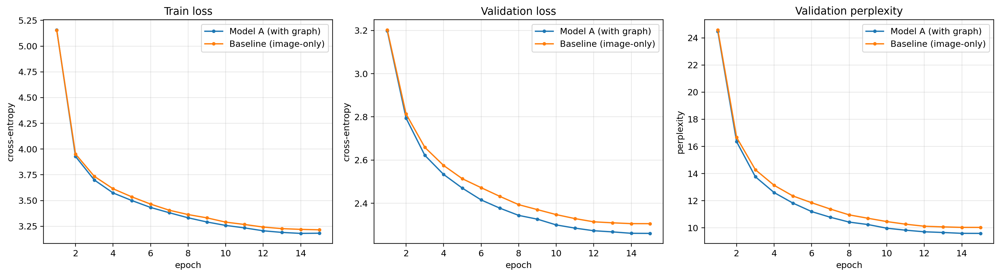


    Best val loss  — with graph: 2.261 | image-only: 2.306
    Best val ppl   — with graph: 9.6 | image-only: 10.0
    the scene graph LOWERS validation loss by 0.045 (2.0% relative)


```python

```

## 11. Model B — a modular 3-stage pipeline

Model A has a flaw: it can only work if it is fed scene-graph information
at training time and inference time, meaning the annotations for the scene
graph must already exist in the training and test data. I wanted a model that is able
to take a fully unseen image, generate bounding boxes and scene graphs,
then create captions for it. Because I already had a caption decoding model,
the the new steps required were the first two parts: getting the scene graph
information from a brand new image.

For that, I fine tuned a YOLO26 object detector. I had to research a little
bit on GNNs, graph neural networks, to create a rudimentary graph predictor.
The last part of the model pipeline remains the same, we can reuse the
decoder components from Model A.

Roughly:
```
image --> [Stage 1: YOLO detector] --> objects (boxes + labels)

objects (boxes + labels) --> [Stage 2: GNN relationship predictor] --> predicates+relations

predictes+relations --> [Stage 3: caption decoder] --> caption
```

Each stage is a model we independantly train and can inspect. This makes
designing and training the individual components easy: I trained various
versions of YOLO, for example, independantly of the rest of the pipeline, until
I was satisfied with its performance. The downside is also the same:
independance makes the chain fragile, and failures or errors in each step
compound to the next. This made it difficult to get good performance. I tried
many variants until I was able to get Model B to get close to the baseline
performance of Model A.

### Stage 1 — fine-tuning a YOLO object detector

YOLO ("You Only Look Once") is a single-shot detector: one forward pass predicts
all boxes and class scores on a grid. The model itself is quite pleasing
and easy to work with: it's website has many examples and tutorials that make
it easy to implement. It also trains fairly fast provided the images are
scaled to a smaller size.

I fine-tuned a pretrained `yolo26s`. The 26 model comes in many variants of
increasing size and complexity, from 'n' to 'x'. The `s` variant is on the
smaller size, but I hoped it would be sufficient. The `yolo26s` is pretrained
on COCO images with 80 image classes, so we fine tune it with a new classifier
head as our data contains 150 classes. That is standard transfer learning: the
backbone already knows generic visual features, we only re-teach the detection
head our label set.

Because I had already resized my images to 224px squares, I first tried to fine-tune
on those images. The first fine-tunes didn't have good performance. After some
reasearch, a suggestion I saw online was to increase the image sizes, as our
images contain 150 fine grain, heavily overlapping object classes, and that
the larger spatial resolution would help the pre-train process. I then experimented
with 512px by 512px (as the bounding boxes already were in that scale), and it
seemed to work a little better. Thus the YOLO detector trains on a parallel
set of images that are resized to 512x512, but have undergone the same
contrast equalization and unsharp mask pipelines.

YOLO expects data in a particular format and directory structure:
- dataset configuration yaml
- train and val directories
- each containing directories called "images" and "labels" containing images and labels in txt format (matched by filename)

First we export the VG boxes into the format the Ultralytics trainer expects —
one `.txt` per image with `class cx cy w h`, all normalised to `[0, 1]`, and a
`data.yaml` naming the 150 classes, as so:

```
yolo
├── train
│   ├── images
│   │   ├── 1.jpg
│   │   └── 2.jpg
│   ├── labels
│   │   ├── 1.txt
│   │   └── 2.txt
│   └── labels.cache
└── vg150.yaml
```

The text files contain individual lines containing space delimited values for:
```
object_id cx cy w h
```

Where the coordinates are normalized between 0..1 relative to the original image's dimension.


```python
# The detector trains and runs at 512px (see above), so it gets its own cached image set
# runs only once
PROC512_DIR = cfg.derived_dir / "proc512"
PROC512_DIR.mkdir(exist_ok=True)


def _preprocess_one_512(rec):
    out_path = PROC512_DIR / f"{rec['image_id']}.jpg"
    if out_path.exists():
        return
    img = Image.open(cfg.image_dir / f"{rec['image_id']}.jpg").convert("RGB")
    w, h = img.size
    img = img.resize(
        (round(w * cfg.long_side / max(w, h)), round(h * cfg.long_side / max(w, h)))
    )
    img = enhance_contrast(img)
    img = sharpen(img, amount=0.6)
    img, _ = resize_and_pad(img, np.empty((0, 4)), cfg.yolo_img_size)
    img.save(out_path, quality=92)


_todo512 = [
    r for r in dataset_index if not (PROC512_DIR / f"{r['image_id']}.jpg").exists()
]
if _todo512:
    from tqdm.auto import tqdm

    print(
        f"Building 512px detector cache for {len(_todo512):,} images "
        f"(one-time, ~{len(_todo512) * 0.03 / 60:.0f} min)..."
    )
    with ThreadPoolExecutor(max_workers=8) as ex:
        list(tqdm(ex.map(_preprocess_one_512, _todo512), total=len(_todo512)))
    print("done.")
else:
    print(f"All {len(dataset_index):,} images already cached at 512px -> {PROC512_DIR}")
```

    All 43,887 images already cached at 512px -> derived/proc512


```python
YOLO_DIR = cfg.derived_dir / "yolo512"
YOLO_TRAIN_SPLIT = "train"
YOLO_VAL_SPLIT = "val"


def export_yolo_dataset():
    done_flag = YOLO_DIR / ".exported"
    # guard against needless rerunning
    if done_flag.exists() and done_flag.read_text() == YOLO_TRAIN_SPLIT:
        print(f"YOLO dataset already exported ({YOLO_TRAIN_SPLIT}) -> {YOLO_DIR}")
        return
    for split, name in [(YOLO_TRAIN_SPLIT, "train"), (YOLO_VAL_SPLIT, "val")]:
        img_dir = YOLO_DIR / name / "images"
        lbl_dir = YOLO_DIR / name / "labels"
        img_dir.mkdir(parents=True, exist_ok=True)
        lbl_dir.mkdir(parents=True, exist_ok=True)
        for i in splits[split]:
            rec = dataset_index[i]
            objs, _ = get_scene_graph(rec["vg_idx"])
            boxes_512 = np.array([[o.cx, o.cy, o.w, o.h] for o in objs], dtype=float)
            boxes = transform_boxes_to_proc(
                boxes_512, rec["width"], rec["height"], target=cfg.yolo_img_size
            )
            # YOLO wants class + normalised cx,cy,w,h; clip to the [0,1] canvas
            lines = []
            for o, (cx, cy, w, h) in zip(objs, boxes):
                cx, cy = cx / cfg.yolo_img_size, cy / cfg.yolo_img_size
                w, h = w / cfg.yolo_img_size, h / cfg.yolo_img_size
                if w <= 0 or h <= 0:
                    continue
                cx, cy = min(max(cx, 0), 1), min(max(cy, 0), 1)
                lines.append(f"{o.label_id - 1} {cx:.6f} {cy:.6f} {w:.6f} {h:.6f}")
            # link the cached 512px preprocessed jpg in, write the label file
            link = img_dir / f"{rec['image_id']}.jpg"
            if not link.exists():
                os.symlink((PROC512_DIR / f"{rec['image_id']}.jpg").resolve(), link)
            (lbl_dir / f"{rec['image_id']}.txt").write_text("\n".join(lines))
    # data.yaml — class id i corresponds to idx_to_label[i + 1]
    names = {i: idx_to_label[i + 1] for i in range(150)}
    yaml_text = (
        f"path: {YOLO_DIR.resolve()}\ntrain: train/images\nval: val/images\n"
        f"nc: 150\nnames:\n" + "\n".join(f"  {i}: {n}" for i, n in names.items())
    )
    (YOLO_DIR / "vg150.yaml").write_text(yaml_text)
    done_flag.write_text(YOLO_TRAIN_SPLIT)
    print(
        f"Exported YOLO dataset ({len(splits[YOLO_TRAIN_SPLIT]):,} train / "
        f"{len(splits[YOLO_VAL_SPLIT]):,} val) -> {YOLO_DIR}"
    )


export_yolo_dataset()
```

    YOLO dataset already exported (train) -> derived/yolo512


```python
from ultralytics import YOLO

YOLO_CKPT = CKPT_DIR / "yolo_vg150_s512.pt"
YOLO_EPOCHS = 50
YOLO_BASE = "yolo26s.pt"


def get_yolo_detector():
    if SKIP or YOLO_CKPT.exists():
        print(f"Loaded cached fine-tuned YOLO -> {YOLO_CKPT}")
        return YOLO(str(YOLO_CKPT))
    print(
        f"Fine-tuning {YOLO_BASE} on VG150 @ {cfg.yolo_img_size}px "
        f"for up to {YOLO_EPOCHS} epochs..."
    )
    model = YOLO(YOLO_BASE)  # COCO-pretrained checkpoint
    model.train(
        data=str((YOLO_DIR / "vg150.yaml").resolve()),
        epochs=YOLO_EPOCHS,
        imgsz=cfg.yolo_img_size,
        batch=0.85,
        patience=10,
        device=0 if DEVICE.type == "cuda" else "cpu",
        project=str((cfg.derived_dir / "yolo_runs").resolve()),
        name="vg150_s512",
        exist_ok=True,
        verbose=False,
    )
    # cache the best.pt the trainer saved (its exact path comes from the trainer)
    best = Path(model.trainer.best)
    if best.exists():
        import shutil

        shutil.copy(best, YOLO_CKPT)
        print(f"Cached fine-tuned YOLO -> {YOLO_CKPT}")
    return YOLO(str(YOLO_CKPT)) if YOLO_CKPT.exists() else model


# looks for trained checkpoint, otherwise launches full fine tuning run
# takes approx 5 hours on my machine (Nvidia 3060Ti)
yolo_detector = get_yolo_detector()
```

    Loaded cached fine-tuned YOLO -> derived/checkpoints/yolo_vg150_s512.pt


We sanity-check the fine-tuned detector on a few validation images and report its
**mean Average Precision**: a standard detection metric which rewards both
finding the right boxes and labelling them correctly.


```python
# mAP on the YOLO val split
yolo_metrics = yolo_detector.val(
    data=str(YOLO_DIR / "vg150.yaml"),
    imgsz=cfg.yolo_img_size,
    verbose=False,
    project=str((cfg.derived_dir / "yolo_runs").resolve()),
    name="vg150_s512_val",
    exist_ok=True,
)
print(
    f"YOLO fine-tuned on VG150  —  mAP50: {yolo_metrics.box.map50:.3f}  "
    f"mAP50-95: {yolo_metrics.box.map:.3f}"
)

# detections on a few validation images
set_seed(cfg.seed + 5)
demo_ids = [dataset_index[i]["image_id"] for i in random.sample(splits["val"], 3)]
fig, axs = plt.subplots(1, 3, figsize=(16, 5.5))
for ax, image_id in zip(axs, demo_ids):
    res = yolo_detector.predict(
        PROC512_DIR / f"{image_id}.jpg",
        verbose=False,
        conf=0.25,
        imgsz=cfg.yolo_img_size,
    )[0]
    ax.imshow(Image.open(PROC512_DIR / f"{image_id}.jpg"))
    for box, cls, conf in zip(
        res.boxes.xyxy.cpu(), res.boxes.cls.cpu(), res.boxes.conf.cpu()
    ):
        x0, y0, x1, y1 = box
        ax.add_patch(
            Rectangle((x0, y0), x1 - x0, y1 - y0, fill=False, edgecolor="cyan", lw=1.5)
        )
        ax.text(
            x0,
            y0 - 2,
            f"{idx_to_label[int(cls) + 1]} {conf:.2f}",
            fontsize=6,
            color="black",
            bbox=dict(facecolor="cyan", alpha=0.8, pad=0.4, boxstyle="round"),
        )
    ax.set_title(f"image {image_id}", fontsize=9)
    ax.set_axis_off()
fig.tight_layout()
plt.show()
```

    Ultralytics 8.4.48 🚀 Python-3.14.4 torch-2.11.0+cu130 CUDA:0 (NVIDIA GeForce RTX 3060 Ti, 7833MiB)
    YOLO26s summary (fused): 122 layers, 9,523,230 parameters, 0 gradients, 20.8 GFLOPs
    val: Fast image access ✅ (ping: 0.0±0.0 ms, read: 6627.3±1268.0 MB/s, size: 97.4 KB)
    val: Scanning /home/ndthp/Projects/final_projects/e25/derived/yolo512/val/labels.cache... 4388 images, 0 backgrounds, 0 corrupt: 100% ━━━━━━━━━━━━ 4388/4388 1.7Git/s 0.0s
    val: /home/ndthp/Projects/final_projects/e25/derived/yolo512/val/images/1592183.jpg: 1 duplicate labels removed
                     Class     Images  Instances      Box(P          R      mAP50  mAP50-95): 100% ━━━━━━━━━━━━ 275/275 13.3it/s 20.7s<0.1s
                       all       4388      64417      0.343      0.298      0.242      0.134
    Speed: 0.2ms preprocess, 3.1ms inference, 0.0ms loss, 0.1ms postprocess per image
    Results saved to /home/ndthp/Projects/final_projects/e25/derived/yolo_runs/vg150_s512_val
    YOLO fine-tuned on VG150  —  mAP50: 0.242  mAP50-95: 0.134


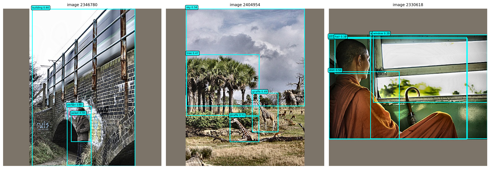


Even though the YOLO detector was fine tuned, note that that the mAP50 and mAP50-95 for this detector is still a very small 0.24 and 0.13 respectively. This ends
up being the 'weakest link' in the chain.

### Stage 2 — a GNN relationship predictor

Stage 1 gives us objects; Stage 2 has to decide how they relate. We frame this
as **edge classification on a graph**: the detected objects are nodes, and for
every ordered pair of nodes we predict one of 51 classes — the 50 VG predicates
or a 51st `no-relation` class.

The model is a small graph neural network (GNN):

1. Each node starts as `object-class embedding + a projection of its box
   geometry`.
2. Two graph-convolution layers let every node's representation absorb context
   from the others — "there is a person near me, and a wave under me".
3. For each ordered pair `(i, j)`, an MLP reads `[node_i ; node_j ;
   pairwise-box-geometry ; union-region visual feature]` and outputs the 51-way
   logits. We RoI-align the union box , taking a look at the region spanning
   both bounding boxes so the classifier actually looks at the place where the
   relationship would be, instead of guessing from labels and geometry alone.

This model, like all parts of this pipeline, can be trained independantly of the
other components. As training input it takes ground-truth graphs from the visual
genome data. Relations are the positive edges, and we sample an equal number of
unrelated pairs as `no-relation` negatives. The loss is a class-balanced focal
loss, cross-entropy down-weighted on already-easy pairs by a `(1 - p_t)`
focusing factor so the easy negatives stop dominating the gradient.

This model was conceptually more difficult for me to grasp, and I had to take
inspiration from various sources online.

(https://lightning.ai/docs/pytorch/stable/notebooks/course_UvA-DL/06-graph-neural-networks.html, see also references)


```python
from torchvision.ops import roi_align

NUM_PREDICATES = 50  # VG predicate classes, ids 1..50
NO_REL = 0  # our 51st class id (0) means "no relation"


class RelationGNN(nn.Module):
    def __init__(self, d_model, n_layers, d_vis=64):
        super().__init__()
        # 150 + 1
        self.obj_embed = nn.Embedding(151, d_model, padding_idx=0)
        self.box_proj = nn.Linear(4, d_model)
        # each "graph conv" layer: transform self + mean of neighbours, then GELU
        self.gconv_self = nn.ModuleList(
            nn.Linear(d_model, d_model) for _ in range(n_layers)
        )
        self.gconv_neigh = nn.ModuleList(
            nn.Linear(d_model, d_model) for _ in range(n_layers)
        )
        self.norms = nn.ModuleList(nn.LayerNorm(d_model) for _ in range(n_layers))
        # a small from-scratch conv stem -> feature map we RoI-align union boxes from
        self.vis_stem = nn.Sequential(
            nn.Conv2d(3, 32, 3, stride=2, padding=1),
            nn.GELU(),  # 224 -> 112
            nn.Conv2d(32, 64, 3, stride=2, padding=1),
            nn.GELU(),  # 112 -> 56
            nn.Conv2d(64, 64, 3, stride=2, padding=1),
            nn.GELU(),
        )  # 56  -> 28
        self.vis_grid = 28  # vis_stem output side
        self.vis_proj = nn.Linear(64 * 3 * 3, d_vis)  # 3x3 RoI-align -> d_vis
        # pairwise edge classifier: [h_i ; h_j ; 8-d geometry ; d_vis union feature]
        self.edge_mlp = nn.Sequential(
            nn.Linear(2 * d_model + 8 + d_vis, d_model),
            nn.GELU(),
            nn.Dropout(0.1),
            nn.Linear(d_model, NUM_PREDICATES + 1),
        )

    def encode_nodes(self, obj_labels, obj_boxes, obj_mask):
        h = self.obj_embed(obj_labels) + self.box_proj(obj_boxes)  # (B, O, d)
        m = obj_mask.float().unsqueeze(-1)  # (B, O, 1)
        for self_lin, neigh_lin, norm in zip(
            self.gconv_self, self.gconv_neigh, self.norms
        ):
            # mean of *other* real nodes (fully-connected graph, no self-loop)
            summed = (h * m).sum(1, keepdim=True) - h * m
            count = m.sum(1, keepdim=True).clamp(min=1) - m
            neigh = summed / count.clamp(min=1)
            h = norm(F.gelu(self_lin(h) + neigh_lin(neigh)) + h)  # residual
            h = h * m
        return h

    def pair_features(self, boxes_i, boxes_j):
        dx = boxes_j[..., 0] - boxes_i[..., 0]
        dy = boxes_j[..., 1] - boxes_i[..., 1]
        return torch.stack(
            [
                dx,
                dy,
                boxes_i[..., 2],
                boxes_i[..., 3],
                boxes_j[..., 2],
                boxes_j[..., 3],
                boxes_i[..., 2] * boxes_i[..., 3],
                boxes_j[..., 2] * boxes_j[..., 3],
            ],
            dim=-1,
        )

    def union_visual(self, images, boxes_i, boxes_j):
        B, P = boxes_i.shape[:2]
        fmap = self.vis_stem(images)  # (B, 64, 28, 28)
        # union-box corners in [0,1], then scaled to feature-map pixels
        x0 = torch.minimum(
            boxes_i[..., 0] - boxes_i[..., 2] / 2, boxes_j[..., 0] - boxes_j[..., 2] / 2
        ).clamp(0, 1)
        y0 = torch.minimum(
            boxes_i[..., 1] - boxes_i[..., 3] / 2, boxes_j[..., 1] - boxes_j[..., 3] / 2
        ).clamp(0, 1)
        x1 = torch.maximum(
            boxes_i[..., 0] + boxes_i[..., 2] / 2, boxes_j[..., 0] + boxes_j[..., 2] / 2
        ).clamp(0, 1)
        y1 = torch.maximum(
            boxes_i[..., 1] + boxes_i[..., 3] / 2, boxes_j[..., 1] + boxes_j[..., 3] / 2
        ).clamp(0, 1)
        g = self.vis_grid
        x1 = torch.maximum(x1, x0 + 1.0 / g)  # guard degenerate boxes
        y1 = torch.maximum(y1, y0 + 1.0 / g)
        bidx = torch.arange(B, device=images.device).view(B, 1).expand(B, P)
        rois = torch.stack(
            [
                bidx.reshape(-1).float(),
                (x0 * g).reshape(-1),
                (y0 * g).reshape(-1),
                (x1 * g).reshape(-1),
                (y1 * g).reshape(-1),
            ],
            dim=1,
        )
        pooled = roi_align(fmap, rois, output_size=3, aligned=True)  # (B*P, 64, 3, 3)
        return self.vis_proj(pooled.flatten(1)).reshape(B, P, -1)  # (B, P, d_vis)

    def forward(self, obj_labels, obj_boxes, obj_mask, pair_idx, images):
        h = self.encode_nodes(obj_labels, obj_boxes, obj_mask)
        B = h.size(0)
        bidx = torch.arange(B, device=h.device).unsqueeze(1)
        h_i = h[bidx, pair_idx[..., 0]]
        h_j = h[bidx, pair_idx[..., 1]]
        boxes_i = obj_boxes[bidx, pair_idx[..., 0]]
        boxes_j = obj_boxes[bidx, pair_idx[..., 1]]
        g = self.pair_features(boxes_i, boxes_j)
        v = self.union_visual(images, boxes_i, boxes_j)
        return self.edge_mlp(torch.cat([h_i, h_j, g, v], dim=-1))
```


```python
# training data for the GNN: GT positive edges + sampled negative pairs
PAIRS_PER_IMG = 32  # candidate pairs classified per image during training


class RelationDataset(Dataset):
    def __init__(self, split_indices):
        self.recs = [dataset_index[i] for i in split_indices]

    def __len__(self):
        return len(self.recs)

    def __getitem__(self, i):
        rec = self.recs[i]
        objs, rels = get_scene_graph(rec["vg_idx"])
        boxes_512 = np.array([[o.cx, o.cy, o.w, o.h] for o in objs], dtype=float)
        boxes_proc = transform_boxes_to_proc(boxes_512, rec["width"], rec["height"])
        sg = encode_scene_graph(objs, rels, boxes_proc)
        n_obj = int(sg["obj_mask"].sum())

        # positive pairs from the GT relations
        pos = {}
        for s, p, o, m in zip(
            sg["rel_subj"], sg["rel_pred"], sg["rel_obj"], sg["rel_mask"]
        ):
            if m:
                pos[(int(s), int(o))] = int(p)
        pairs, targets = [], []
        for (s, o), p in pos.items():
            pairs.append((s, o))
            targets.append(p)
        # negative pairs: random ordered pairs of real objects that are not related
        tries = 0
        while len(pairs) < PAIRS_PER_IMG and n_obj > 1 and tries < 200:
            s, o = random.randrange(n_obj), random.randrange(n_obj)
            tries += 1
            if s != o and (s, o) not in pos:
                pairs.append((s, o))
                targets.append(NO_REL)
        # pad to a fixed number of pairs
        while len(pairs) < PAIRS_PER_IMG:
            pairs.append((0, 0))
            targets.append(-100)  # -100 = ignored by loss
        pairs = pairs[:PAIRS_PER_IMG]
        targets = targets[:PAIRS_PER_IMG]
        # the GNN's union-box features need the image — the 224px captioner cache
        img = Image.open(PROC_DIR / f"{rec['image_id']}.jpg").convert("RGB")
        return {
            "obj_labels": sg["obj_labels"],
            "obj_boxes": sg["obj_boxes"],
            "obj_mask": sg["obj_mask"],
            "image": to_tensor_norm(img),
            "pair_idx": torch.tensor(pairs, dtype=torch.long),
            "pred_target": torch.tensor(targets, dtype=torch.long),
        }


def _predicate_class_weights():
    # 1/sqrt(freq) weightint
    counts = np.ones(NUM_PREDICATES + 1)  # +1 Laplace smoothing; idx 0 = NO_REL
    for i in splits[TRAIN_SPLIT]:
        _, rels = get_scene_graph(dataset_index[i]["vg_idx"])
        for r in rels:
            counts[r.predicate_id] += 1
    counts[NO_REL] = counts[1:].mean()  # negatives are ~1:1 sampled per image
    w = (counts.sum() / (len(counts) * counts)) ** 0.5
    return torch.tensor(w / w.mean(), dtype=torch.float)


def focal_ce(logits, target, weight, gamma=2.0):
    keep = target != -100
    if not keep.any():
        return logits.sum() * 0.0
    logits, target = logits[keep], target[keep]
    logp_t = F.log_softmax(logits, dim=-1).gather(1, target[:, None]).squeeze(1)
    w = weight.to(logits.device)[target]
    return -(w * (1 - logp_t.exp()) ** gamma * logp_t).mean()


# train loop
def train_relation_gnn(n_epochs):
    set_seed(cfg.seed)
    model = RelationGNN(cfg.d_model, cfg.n_graph_layers).to(DEVICE)
    tr = DataLoader(
        RelationDataset(splits[TRAIN_SPLIT]),
        batch_size=64,
        shuffle=True,
        num_workers=4,
        drop_last=True,
    )
    va = DataLoader(RelationDataset(splits["val"]), batch_size=64, num_workers=4)
    optim = torch.optim.AdamW(model.parameters(), lr=1e-3, weight_decay=1e-4)
    class_w = _predicate_class_weights()
    history = {"train_loss": [], "val_loss": [], "val_acc": []}
    for epoch in range(1, n_epochs + 1):
        model.train()
        run, seen = 0.0, 0
        for b in tr:
            b = {k: v.to(DEVICE) for k, v in b.items()}
            optim.zero_grad(set_to_none=True)
            logits = model(
                b["obj_labels"],
                b["obj_boxes"],
                b["obj_mask"],
                b["pair_idx"],
                b["image"],
            )
            loss = focal_ce(
                logits.reshape(-1, NUM_PREDICATES + 1),
                b["pred_target"].reshape(-1),
                class_w,
            )
            loss.backward()
            nn.utils.clip_grad_norm_(model.parameters(), 1.0)
            optim.step()
            run += loss.item() * b["obj_labels"].size(0)
            seen += b["obj_labels"].size(0)
        # validation: loss + accuracy over non-ignored pairs
        model.eval()
        vrun, vseen, correct, total = 0.0, 0, 0, 0
        with torch.no_grad():
            for b in va:
                b = {k: v.to(DEVICE) for k, v in b.items()}
                logits = model(
                    b["obj_labels"],
                    b["obj_boxes"],
                    b["obj_mask"],
                    b["pair_idx"],
                    b["image"],
                )
                tgt = b["pred_target"].reshape(-1)
                lg = logits.reshape(-1, NUM_PREDICATES + 1)
                loss = focal_ce(lg, tgt, class_w)
                vrun += loss.item() * b["obj_labels"].size(0)
                vseen += b["obj_labels"].size(0)
                keep = tgt != -100
                correct += (lg[keep].argmax(-1) == tgt[keep]).sum().item()
                total += keep.sum().item()
        history["train_loss"].append(run / seen)
        history["val_loss"].append(vrun / vseen)
        history["val_acc"].append(correct / max(total, 1))
        print(
            f"  epoch {epoch:2d}/{n_epochs}  train {run / seen:.3f}  "
            f"val {vrun / vseen:.3f}  val acc {correct / max(total, 1):.3f}"
        )
    return model, history


GNN_CKPT = CKPT_DIR / f"relation_gnn2_full.pt"
GNN_EPOCHS = 12
if SKIP or GNN_CKPT.exists():
    relation_gnn = RelationGNN(cfg.d_model, cfg.n_graph_layers).to(DEVICE)
    _ck = torch.load(GNN_CKPT, map_location=DEVICE)
    relation_gnn.load_state_dict(_ck["model"])
    hist_gnn = _ck["history"]
    print(f"Loaded cached relation GNN (raw val acc {max(hist_gnn['val_acc']):.3f})")
else:
    relation_gnn, hist_gnn = train_relation_gnn(GNN_EPOCHS)
    torch.save({"model": relation_gnn.state_dict(), "history": hist_gnn}, GNN_CKPT)
```

    Loaded cached relation GNN (raw val acc 0.878)


### Assembling the pipeline

`predict_scene_graph` chains the two trained stages: YOLO proposes objects, the
GNN scores every ordered pair of those objects, and we keep the highest-scoring
non-`no-relation` edges. The result is a scene-graph tensor bundle in the same
format Model A's captioner uses, meaning we can reuse that already trained
component to generate images.


```python
@torch.no_grad()
def predict_scene_graph(image_id, conf=0.25, max_edges=cfg.max_relations):
    # stage 1: YOLO detection
    res = yolo_detector.predict(
        PROC512_DIR / f"{image_id}.jpg",
        verbose=False,
        conf=conf,
        imgsz=cfg.yolo_img_size,
    )[0]
    xywh = res.boxes.xywh.cpu().numpy()[: cfg.max_objects]  # cx,cy,w,h pixels
    cls = res.boxes.cls.cpu().numpy()[: cfg.max_objects].astype(int)
    n = len(cls)

    obj_labels = torch.zeros(cfg.max_objects, dtype=torch.long)
    obj_boxes = torch.zeros(cfg.max_objects, 4)
    obj_mask = torch.zeros(cfg.max_objects, dtype=torch.bool)
    for i in range(n):
        obj_labels[i] = int(cls[i]) + 1  # YOLO 0-based -> VG 1-based
        obj_boxes[i] = torch.tensor(xywh[i]) / cfg.yolo_img_size
        obj_mask[i] = True
    if n == 0:
        # YOLO found nothing — fall back to one whole-image "object" so the
        # graph encoder always has a valid (non-empty) node set to attend over.
        obj_labels[0], obj_boxes[0], obj_mask[0] = (
            1,
            torch.tensor([0.5, 0.5, 1.0, 1.0]),
            True,
        )
        n = 1

    rel_subj = torch.zeros(cfg.max_relations, dtype=torch.long)
    rel_pred = torch.zeros(cfg.max_relations, dtype=torch.long)
    rel_obj = torch.zeros(cfg.max_relations, dtype=torch.long)
    rel_mask = torch.zeros(cfg.max_relations, dtype=torch.bool)
    if n > 1:
        # stage 2: GNN scores every ordered pair of detected objects. The GNN
        # also reads the image for its union-box features; it was trained on the
        # 224px captioner cache, so feed it that — not the 512px detector cache.
        gnn_img = (
            to_tensor_norm(Image.open(PROC_DIR / f"{image_id}.jpg").convert("RGB"))
            .unsqueeze(0)
            .to(DEVICE)
        )
        pairs = [(i, j) for i in range(n) for j in range(n) if i != j]
        pair_idx = torch.tensor(pairs, dtype=torch.long, device=DEVICE).unsqueeze(0)
        logits = relation_gnn(
            obj_labels.unsqueeze(0).to(DEVICE),
            obj_boxes.unsqueeze(0).to(DEVICE),
            obj_mask.unsqueeze(0).to(DEVICE),
            pair_idx,
            gnn_img,
        )[0]
        prob = logits.softmax(-1)
        prob[:, NO_REL] = 0  # ignore the no-relation class
        best_p, best_c = prob.max(-1)  # best predicate per pair
        for slot, pair_i in enumerate(best_p.argsort(descending=True)[:max_edges]):
            s, o = pairs[int(pair_i)]
            rel_subj[slot], rel_obj[slot] = s, o
            rel_pred[slot] = int(best_c[pair_i])
            rel_mask[slot] = True
    return {
        "obj_labels": obj_labels,
        "obj_boxes": obj_boxes,
        "obj_mask": obj_mask,
        "rel_subj": rel_subj,
        "rel_pred": rel_pred,
        "rel_obj": rel_obj,
        "rel_mask": rel_mask,
    }


def caption_with_pipeline(image_id, caption_model):
    # full Model B inference: predicted graph + image -> caption string
    sg = predict_scene_graph(image_id)
    img = Image.open(PROC_DIR / f"{image_id}.jpg").convert("RGB")
    batch = {k: v.unsqueeze(0).to(DEVICE) for k, v in sg.items()}
    batch["image"] = to_tensor_norm(img).unsqueeze(0).to(DEVICE)
    return caption_model.generate(batch)[0]


# demo: compare a predicted scene graph against the ground truth on one val image
_demo_id = dataset_index[splits["val"][0]]["image_id"]
_pred_sg = predict_scene_graph(_demo_id)
_n_obj = int(_pred_sg["obj_mask"].sum())
_n_rel = int(_pred_sg["rel_mask"].sum())
print(
    f"Pipeline on val image {_demo_id}: "
    f"YOLO found {_n_obj} objects, GNN kept {_n_rel} relations"
)
print("Predicted edges:")
for s, p, o, m in zip(
    _pred_sg["rel_subj"],
    _pred_sg["rel_pred"],
    _pred_sg["rel_obj"],
    _pred_sg["rel_mask"],
):
    if m:
        sl = idx_to_label.get(int(_pred_sg["obj_labels"][s]), "?")
        ol = idx_to_label.get(int(_pred_sg["obj_labels"][o]), "?")
        print(f"  {sl} --{idx_to_predicate.get(int(p), '?')}--> {ol}")
```

    Pipeline on val image 2415095: YOLO found 4 objects, GNN kept 12 relations
    Predicted edges:
      person --has--> eye
      person --has--> ear
      person --has--> ear
      ear --of--> person
      eye --of--> person
      ear --of--> person
      ear --in--> ear
      ear --on--> ear
      eye --on--> ear
      ear --has--> eye
      ear --has--> eye
      eye --near--> ear


## 12. Evaluation

Finally, we can compare the above 3 models (image only Model A, image +
scenegraph Model A, and Model B) by generating captions on the test set and
using classic NLP metrics to compare against the ground truth COCO captions.

- **BLEU-1 / BLEU-4** — n-gram precision against the references. BLEU-1 rewards
  getting the right *words*; BLEU-4 rewards getting right *4-word phrases*, i.e.
  fluency and word order.
- **ROUGE-L** — longest-common-subsequence overlap; recall-oriented, less harsh
  on word order than BLEU-4.
- **METEOR** — aligns words allowing synonyms and stems, and correlates better
  with human judgement than BLEU at the sentence level.

Using several metrics is deliberate: they disagree in informative ways, and a
single number would hide that.


```python
import nltk
from nltk.translate.bleu_score import SmoothingFunction, corpus_bleu
from rouge_score import rouge_scorer

try:
    nltk.data.find("corpora/wordnet")
except LookupError:
    nltk.download("wordnet", quiet=True)
from nltk.translate.meteor_score import meteor_score

_rouge = rouge_scorer.RougeScorer(["rougeL"], use_stemmer=True)
_smooth = SmoothingFunction().method1  # avoids zero BLEU on short captions


def compute_caption_metrics(preds, refs_list):
    pred_toks = [tokenize(p) for p in preds]
    refs_toks = [[tokenize(r) for r in refs] for refs in refs_list]
    bleu1 = corpus_bleu(
        refs_toks, pred_toks, weights=(1, 0, 0, 0), smoothing_function=_smooth
    )
    bleu4 = corpus_bleu(
        refs_toks, pred_toks, weights=(0.25,) * 4, smoothing_function=_smooth
    )
    rouge_l, meteor = [], []
    for pred, refs, ptoks, rtoks in zip(preds, refs_list, pred_toks, refs_toks):
        rouge_l.append(max(_rouge.score(r, pred)["rougeL"].fmeasure for r in refs))
        meteor.append(meteor_score(rtoks, ptoks))
    return {
        "BLEU-1": 100 * bleu1,
        "BLEU-4": 100 * bleu4,
        "ROUGE-L": 100 * np.mean(rouge_l),
        "METEOR": 100 * np.mean(meteor),
    }


@torch.no_grad()
def generate_over_split(model, split_name, limit=None, use_pipeline=False):
    model.eval()
    split_idx = splits[split_name][:limit] if limit else splits[split_name]
    preds, refs, idxs = [], [], []
    loader = DataLoader(
        VGCaptionDataset(split_idx, train=False),
        batch_size=cfg.batch_size,
        collate_fn=custom_collate,
        num_workers=4,
    )
    for batch in loader:
        gpu = {
            k: (v.to(DEVICE) if isinstance(v, torch.Tensor) else v)
            for k, v in batch.items()
        }
        if use_pipeline:
            # rebuild the scene-graph fields from the YOLO+GNN pipeline.
            # batch["vg_idx"] indexes image_data, which carries the jpg's image_id.
            sgs = [
                predict_scene_graph(image_data[v]["image_id"]) for v in batch["vg_idx"]
            ]
            for key in (
                "obj_labels",
                "obj_boxes",
                "obj_mask",
                "rel_subj",
                "rel_pred",
                "rel_obj",
                "rel_mask",
            ):
                gpu[key] = torch.stack([s[key] for s in sgs]).to(DEVICE)
        preds.extend(model.generate(gpu))
        refs.extend(batch["references"])
        idxs.extend(batch["vg_idx"])
    return preds, refs, idxs


# how many test images to score. The full test split is large; a fixed-seed
# sample keeps the notebook quick while staying statistically stable.
EVAL_LIMIT = 1500
print(f"Generating captions on {EVAL_LIMIT} test images for each model...")
preds_graph, refs_test, idx_test = generate_over_split(
    model_A_graph, "test", EVAL_LIMIT
)
preds_base, _, _ = generate_over_split(model_A_base, "test", EVAL_LIMIT)
print("done.")
```

    Generating captions on 1500 test images for each model...
    done.


### Final results: does the scene graph help?

For the two versions of Model A, we have the same architecture, same training
hyperparameters, same test images; the only difference is whether the decoder
can see the scene graph. So does the inclusion of a scene graph make a positive
difference in the quality of the captions?

The answer is yes, marginally.


```python
metrics_graph = compute_caption_metrics(preds_graph, refs_test)
metrics_base = compute_caption_metrics(preds_base, refs_test)

results_A = pd.DataFrame(
    {"Image-only baseline": metrics_base, "Model A (with graph)": metrics_graph}
).T
results_A["Δ vs baseline"] = (
    results_A["BLEU-4"] - results_A.loc["Image-only baseline", "BLEU-4"]
)
print("Caption metrics on the test split (higher is better):\n")
display(results_A.round(2))

# grouped bar chart
fig, ax = plt.subplots(figsize=(9, 4.5))
metric_names = ["BLEU-1", "BLEU-4", "ROUGE-L", "METEOR"]
x = np.arange(len(metric_names))
ax.bar(
    x - 0.2,
    [metrics_base[m] for m in metric_names],
    0.4,
    label="Image-only baseline",
    color="lightsteelblue",
)
ax.bar(
    x + 0.2,
    [metrics_graph[m] for m in metric_names],
    0.4,
    label="Model A (with graph)",
    color="steelblue",
)
ax.set_xticks(x)
ax.set_xticklabels(metric_names)
ax.set(
    title="Caption quality: image-only vs. scene-graph-conditioned",
    ylabel="score (0-100)",
)
ax.legend()
ax.grid(axis="y", alpha=0.3)
for i, m in enumerate(metric_names):
    ax.text(
        i + 0.2,
        metrics_graph[m] + 0.4,
        f"{metrics_graph[m]:.1f}",
        ha="center",
        fontsize=8,
    )
fig.tight_layout()
plt.show()
```

    Caption metrics on the test split (higher is better):


<div>
<style scoped>
    .dataframe tbody tr th:only-of-type {
        vertical-align: middle;
    }

    .dataframe tbody tr th {
        vertical-align: top;
    }

    .dataframe thead th {
        text-align: right;
    }
</style>
<table border="1" class="dataframe">
  <thead>
    <tr style="text-align: right;">
      <th></th>
      <th>BLEU-1</th>
      <th>BLEU-4</th>
      <th>ROUGE-L</th>
      <th>METEOR</th>
      <th>Δ vs baseline</th>
    </tr>
  </thead>
  <tbody>
    <tr>
      <th>Image-only baseline</th>
      <td>68.16</td>
      <td>22.78</td>
      <td>48.48</td>
      <td>43.56</td>
      <td>0.00</td>
    </tr>
    <tr>
      <th>Model A (with graph)</th>
      <td>69.70</td>
      <td>24.50</td>
      <td>50.17</td>
      <td>45.28</td>
      <td>1.72</td>
    </tr>
  </tbody>
</table>
</div>


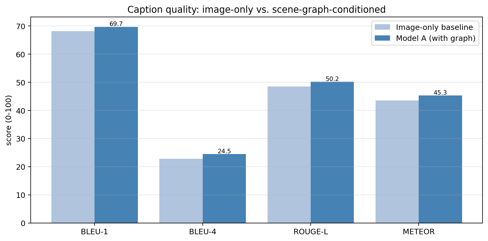


I was a little disappointed when I first saw these results. I was expecting an amazing jump in scores for the image+scene-graph model. But the fact that
all of these various metrics are improved, even by a little, with the inclusion of the scene-graph, leads me to conclude that yes, there is a positive
impact and that the Scene-Graph *is* contributing to the creation of better captions.


```python

```

### Model A vs. Model B

Model A is fed the ground-truth scene graph, but Model B builds the graph itself
with the YOLO detector and the relationship GNN. Feeding the same trained
decoder both kinds of graph isolates one quantity: how much caption quality we
lose to imperfect detection and relationship prediction, the error-propagation
problem of a modular pipeline.


```python
# Model B = the SAME trained context-aware decoder, but fed YOLO+GNN graphs.
print(f"Generating Model B (pipeline) captions on {EVAL_LIMIT} test images...")
preds_pipeline, _, _ = generate_over_split(
    model_A_graph, "test", EVAL_LIMIT, use_pipeline=True
)
metrics_pipeline = compute_caption_metrics(preds_pipeline, refs_test)

results_AB = pd.DataFrame(
    {
        "Image-only baseline": metrics_base,
        "Model B (predicted graph)": metrics_pipeline,
        "Model A (ground-truth graph)": metrics_graph,
    }
).T
print("Caption metrics — baseline vs. pipeline vs. oracle graph:\n")
display(results_AB.round(2))

fig, ax = plt.subplots(figsize=(9, 4.5))
x = np.arange(len(metric_names))
for off, (label, mt, c) in zip(
    [-0.27, 0, 0.27],
    [
        ("Image-only baseline", metrics_base, "lightsteelblue"),
        ("Model B (predicted graph)", metrics_pipeline, "mediumseagreen"),
        ("Model A (GT graph)", metrics_graph, "steelblue"),
    ],
):
    ax.bar(x + off, [mt[m] for m in metric_names], 0.27, label=label, color=c)
ax.set_xticks(x)
ax.set_xticklabels(metric_names)
ax.set(
    title="Caption quality: image-only baseline vs. predicted vs. ground-truth scene graphs",
    ylabel="score (0-100)",
)
ax.legend()
ax.grid(axis="y", alpha=0.3)
fig.tight_layout()
plt.show()
```

    Generating Model B (pipeline) captions on 1500 test images...
    Caption metrics — baseline vs. pipeline vs. oracle graph:


<div>
<style scoped>
    .dataframe tbody tr th:only-of-type {
        vertical-align: middle;
    }

    .dataframe tbody tr th {
        vertical-align: top;
    }

    .dataframe thead th {
        text-align: right;
    }
</style>
<table border="1" class="dataframe">
  <thead>
    <tr style="text-align: right;">
      <th></th>
      <th>BLEU-1</th>
      <th>BLEU-4</th>
      <th>ROUGE-L</th>
      <th>METEOR</th>
    </tr>
  </thead>
  <tbody>
    <tr>
      <th>Image-only baseline</th>
      <td>68.16</td>
      <td>22.78</td>
      <td>48.48</td>
      <td>43.56</td>
    </tr>
    <tr>
      <th>Model B (predicted graph)</th>
      <td>68.05</td>
      <td>23.42</td>
      <td>48.91</td>
      <td>44.12</td>
    </tr>
    <tr>
      <th>Model A (ground-truth graph)</th>
      <td>69.70</td>
      <td>24.50</td>
      <td>50.17</td>
      <td>45.28</td>
    </tr>
  </tbody>
</table>
</div>


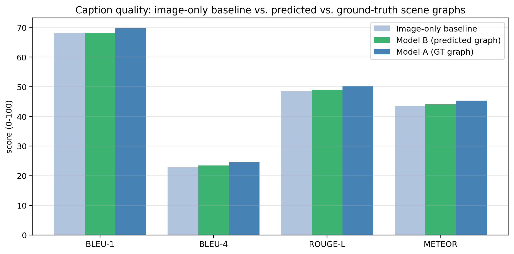


Model A, fed the ground-truth graph, clearly beats the image-only baseline.

Model B — the full pipeline that has to build the graph
from pixels — now lifts every point estimate very slightly above the baseline
(BLEU-4 23.42 vs. 22.78, ROUGE-L 48.91 vs. 48.48, METEOR 44.12 vs. 43.56), but
the difference is small enough to need further study to say whether or not it's
a statistically significant change at all.

Original versions of Model B were performing well under even the baseline of
Model A, until I retrained YOLO with a larger base model (YOLO26s vs YOLO26n),
for more epochs (100 vs 50) and with larger image sizes (512 vs 224). This tells
me that a major weakness of this approach is how the pipeline cascades: if YOLO
cannot properly detect, then the GNN cannot properly predict predicates, and so
the final caption suffers.

Further study would involve looking into merging these three Model B pipeline
steps into one training loop, so the gradients flow through all the layers
all at once.


```python

```

### An aside: Was preprocessing worth it?

Earlier I applied two classical preprocessing steps largely on faith: **CLAHE
contrast enhancement** (a fixed step, baked into the cached images) and **random
geometric augmentation** (flips + affine jitter, applied per training batch).

While generally good practice, I over time I started to wonder if they were
needed at all, so I spent a little time writing a small test.

The test is small: train the graph model four times on the `small` split,
toggling CLAHE and augmentation independently, and compare validation loss.


```python
# build a no-CLAHE, no-sharpen 224px cache for the control images
PROC_RAW = cfg.derived_dir / "proc_raw"
PROC_RAW.mkdir(exist_ok=True)


def _raw_one(rec):
    out = PROC_RAW / f"{rec['image_id']}.jpg"
    if out.exists():
        return
    img = Image.open(cfg.image_dir / f"{rec['image_id']}.jpg").convert("RGB")
    w, h = img.size
    img = img.resize(
        (round(w * cfg.long_side / max(w, h)), round(h * cfg.long_side / max(w, h)))
    )
    img, _ = resize_and_pad(img, np.empty((0, 4)), cfg.img_size)  # NO clahe / sharpen
    img.save(out, quality=92)


_exp_recs = [
    dataset_index[i] for i in sorted(set(splits["train_small"]) | set(splits["val"]))
]
_todo = [r for r in _exp_recs if not (PROC_RAW / f"{r['image_id']}.jpg").exists()]
if _todo:
    print(f"building raw (no-CLAHE) cache for {len(_todo)} ablation images...")
    with ThreadPoolExecutor(max_workers=8) as ex:
        list(ex.map(_raw_one, _todo))

# four loops: clahe on/off x augmentation on/off
EXPERIMENT_EPOCHS = 6
_rows = []
for use_clahe in (True, False):
    for use_aug in (True, False):
        set_seed(cfg.seed)
        m = CaptionModel(cfg, vocab, use_graph=True).to(DEVICE)
        _, h = train_caption_model(
            m,
            f"c{int(use_clahe)}_a{int(use_aug)}_full",
            "train_small",
            EXPERIMENT_EPOCHS,
            proc_dir=(PROC_DIR if use_clahe else PROC_RAW),
            augment=use_aug,
        )
        _rows.append(
            {
                "CLAHE": "on" if use_clahe else "off",
                "augmentation": "on" if use_aug else "off",
                "best val loss": min(h["val_loss"]),
                "best val ppl": min(h["val_ppl"]),
            }
        )
        del m
        torch.cuda.empty_cache() if DEVICE.type == "cuda" else None

abl_df = pd.DataFrame(_rows)
print(
    f"\nCLAHE x augmentation ablation (graph model, {EXPERIMENT_EPOCHS} epochs on the small split):\n"
)
display(abl_df.round(3))

_full = abl_df[(abl_df.CLAHE == "on") & (abl_df.augmentation == "on")][
    "best val loss"
].iloc[0]
_noclahe = abl_df[(abl_df.CLAHE == "off") & (abl_df.augmentation == "on")][
    "best val loss"
].iloc[0]
_noaug = abl_df[(abl_df.CLAHE == "on") & (abl_df.augmentation == "off")][
    "best val loss"
].iloc[0]
print(f"\nvs. the full-preprocessing run (CLAHE+aug, val loss {_full:.3f}):")
print(f"  removing CLAHE        : {_noclahe - _full:+.3f} val loss")
print(f"  removing augmentation : {_noaug - _full:+.3f} val loss")
print(
    "  (positive = that step was helping; near-zero = no measurable effect at this scale)"
)
```

    Training 'c1_a1_full': 2,000 imgs, 6 epochs, 23.5M trainable params
      epoch  1/6  train 6.660  val 4.889  ppl  132.8  (9s)
      epoch  2/6  train 5.224  val 4.407  ppl   82.0  (8s)
      epoch  3/6  train 4.911  val 4.163  ppl   64.3  (8s)
      epoch  4/6  train 4.727  val 4.047  ppl   57.2  (8s)
      epoch  5/6  train 4.637  val 3.995  ppl   54.3  (8s)
      epoch  6/6  train 4.616  val 3.980  ppl   53.5  (8s)
    Training 'c1_a0_full': 2,000 imgs, 6 epochs, 23.5M trainable params
      epoch  1/6  train 6.657  val 4.910  ppl  135.6  (8s)
      epoch  2/6  train 5.214  val 4.392  ppl   80.8  (8s)
      epoch  3/6  train 4.905  val 4.169  ppl   64.6  (8s)
      epoch  4/6  train 4.695  val 4.042  ppl   56.9  (8s)
      epoch  5/6  train 4.597  val 3.982  ppl   53.6  (8s)
      epoch  6/6  train 4.564  val 3.975  ppl   53.2  (8s)
    Training 'c0_a1_full': 2,000 imgs, 6 epochs, 23.5M trainable params
      epoch  1/6  train 6.659  val 4.888  ppl  132.6  (8s)
      epoch  2/6  train 5.223  val 4.400  ppl   81.4  (8s)
      epoch  3/6  train 4.912  val 4.169  ppl   64.7  (8s)
      epoch  4/6  train 4.730  val 4.047  ppl   57.2  (8s)
      epoch  5/6  train 4.635  val 3.994  ppl   54.3  (8s)
      epoch  6/6  train 4.614  val 3.979  ppl   53.4  (8s)
    Training 'c0_a0_full': 2,000 imgs, 6 epochs, 23.5M trainable params
      epoch  1/6  train 6.656  val 4.913  ppl  136.0  (8s)
      epoch  2/6  train 5.217  val 4.391  ppl   80.7  (8s)
      epoch  3/6  train 4.903  val 4.167  ppl   64.5  (8s)
      epoch  4/6  train 4.687  val 4.030  ppl   56.3  (8s)
      epoch  5/6  train 4.590  val 3.979  ppl   53.4  (8s)
      epoch  6/6  train 4.558  val 3.972  ppl   53.1  (8s)

    CLAHE x augmentation ablation (graph model, 6 epochs on the small split):


<div>
<style scoped>
    .dataframe tbody tr th:only-of-type {
        vertical-align: middle;
    }

    .dataframe tbody tr th {
        vertical-align: top;
    }

    .dataframe thead th {
        text-align: right;
    }
</style>
<table border="1" class="dataframe">
  <thead>
    <tr style="text-align: right;">
      <th></th>
      <th>CLAHE</th>
      <th>augmentation</th>
      <th>best val loss</th>
      <th>best val ppl</th>
    </tr>
  </thead>
  <tbody>
    <tr>
      <th>0</th>
      <td>on</td>
      <td>on</td>
      <td>3.980</td>
      <td>53.539</td>
    </tr>
    <tr>
      <th>1</th>
      <td>on</td>
      <td>off</td>
      <td>3.975</td>
      <td>53.246</td>
    </tr>
    <tr>
      <th>2</th>
      <td>off</td>
      <td>on</td>
      <td>3.979</td>
      <td>53.441</td>
    </tr>
    <tr>
      <th>3</th>
      <td>off</td>
      <td>off</td>
      <td>3.972</td>
      <td>53.104</td>
    </tr>
  </tbody>
</table>
</div>


    vs. the full-preprocessing run (CLAHE+aug, val loss 3.980):
      removing CLAHE        : -0.002 val loss
      removing augmentation : -0.005 val loss
      (positive = that step was helping; near-zero = no measurable effect at this scale)


Discussion: This is a deliberately small and fast experiment (the `small` split,
six epochs) so the differences are modest and should be read as directional, not
definitive. Since the differences are so small, I cannot say without trying on
multiple different seeded splits whether or not the differences are
statistically significant. A further investigation would need to try this
experiment on a larger evaluation set.

As it is, I find the results inconclusive. I cannot honestly say that the
preprocessing steps helped or hindered the performance of the final model.


```python

```

### Final comparision: looking at generated captions

Below are some test images with the ground-truth COCO caption and the three
models' generated captions side by side.


```python
set_seed(cfg.seed + 9)
show_n = 6
pick = random.sample(range(len(idx_test)), show_n)
fig, axs = plt.subplots(2, 3, figsize=(17, 11))
for ax, k in zip(axs.ravel(), pick):
    vg_idx = idx_test[k]
    rec = next(r for r in dataset_index if r["vg_idx"] == vg_idx)
    ax.imshow(Image.open(PROC_DIR / f"{rec['image_id']}.jpg"))
    ax.set_axis_off()
    txt = (
        f"GT:        {refs_test[k][0]}\n"
        f"baseline:  {preds_base[k]}\n"
        f"Model A:   {preds_graph[k]}\n"
        f"Model B:   {preds_pipeline[k]}"
    )
    ax.set_title(txt, fontsize=8, loc="left", family="monospace")
fig.tight_layout()
plt.show()
```


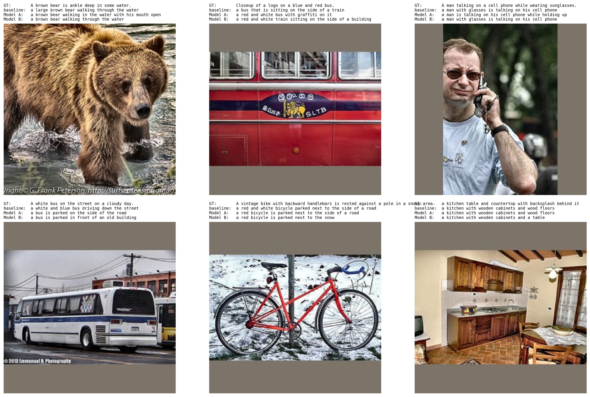


```python

```

## 13. End-to-end inference on a new image

The reason I even tried to write Model B is because I started this project with
the idea of an end-to-end captioner. While iterating and experimenting with
different ideas I eventually wrote what became Model A, but I still felt that I
wanted the full pipeline, hence the extra work creating it.

Therefore, below I finally get to demonstrate the entire 'pipeline' working. It
takes a completely unseen image, preprocesses it, resizes it, YOLO detects it,
generates scene graph predictions, and finally, outputs a caption from the
decoder.


```python
def caption_new_image(path, show=True):
    # preprocess identically to the training pipeline
    img = Image.open(path).convert("RGB")
    w, h = img.size
    img512 = img.resize(
        (round(w * cfg.long_side / max(w, h)), round(h * cfg.long_side / max(w, h)))
    )
    enhanced = sharpen(enhance_contrast(img512))
    proc, _ = resize_and_pad(
        enhanced, np.empty((0, 4)), cfg.img_size
    )  # captioner 224px
    proc512, _ = resize_and_pad(
        enhanced, np.empty((0, 4)), cfg.yolo_img_size
    )  # detector 512px
    # save them to a temporary location
    tmp_id = "_newimg_tmp"
    proc.save(PROC_DIR / f"{tmp_id}.jpg", quality=92)
    proc512.save(PROC512_DIR / f"{tmp_id}.jpg", quality=92)
    sg = predict_scene_graph(tmp_id)
    batch = {k: v.unsqueeze(0).to(DEVICE) for k, v in sg.items()}
    batch["image"] = to_tensor_norm(proc).unsqueeze(0).to(DEVICE)
    caption = model_A_graph.generate(batch)[0]
    (PROC_DIR / f"{tmp_id}.jpg").unlink(missing_ok=True)
    (PROC512_DIR / f"{tmp_id}.jpg").unlink(missing_ok=True)

    if show:
        fig, ax = plt.subplots(figsize=(8, 8))
        ax.imshow(proc)
        for i in range(int(sg["obj_mask"].sum())):
            cx, cy, bw, bh = (sg["obj_boxes"][i] * cfg.img_size).tolist()
            ax.add_patch(
                Rectangle(
                    (cx - bw / 2, cy - bh / 2),
                    bw,
                    bh,
                    fill=False,
                    edgecolor="cyan",
                    lw=1.3,
                )
            )
            ax.text(
                cx - bw / 2,
                cy - bh / 2 - 2,
                idx_to_label.get(int(sg["obj_labels"][i]), "?"),
                fontsize=7,
                bbox=dict(facecolor="cyan", alpha=0.8, pad=0.4, boxstyle="round"),
            )
        ax.set_title(f'Generated caption: "{caption}"', fontsize=11)
        ax.set_axis_off()
        plt.show()
    return caption


# demo on a held-out test image, treated as "brand new" (its raw jpg, not the cache)
_new_rec = dataset_index[splits["test"][123]]
_cap = caption_new_image(cfg.image_dir / f"{_new_rec['image_id']}.jpg")
print(f'\nPipeline caption : "{_cap}"')
print(f'Human reference  : "{_new_rec["captions"][0]}"')
```


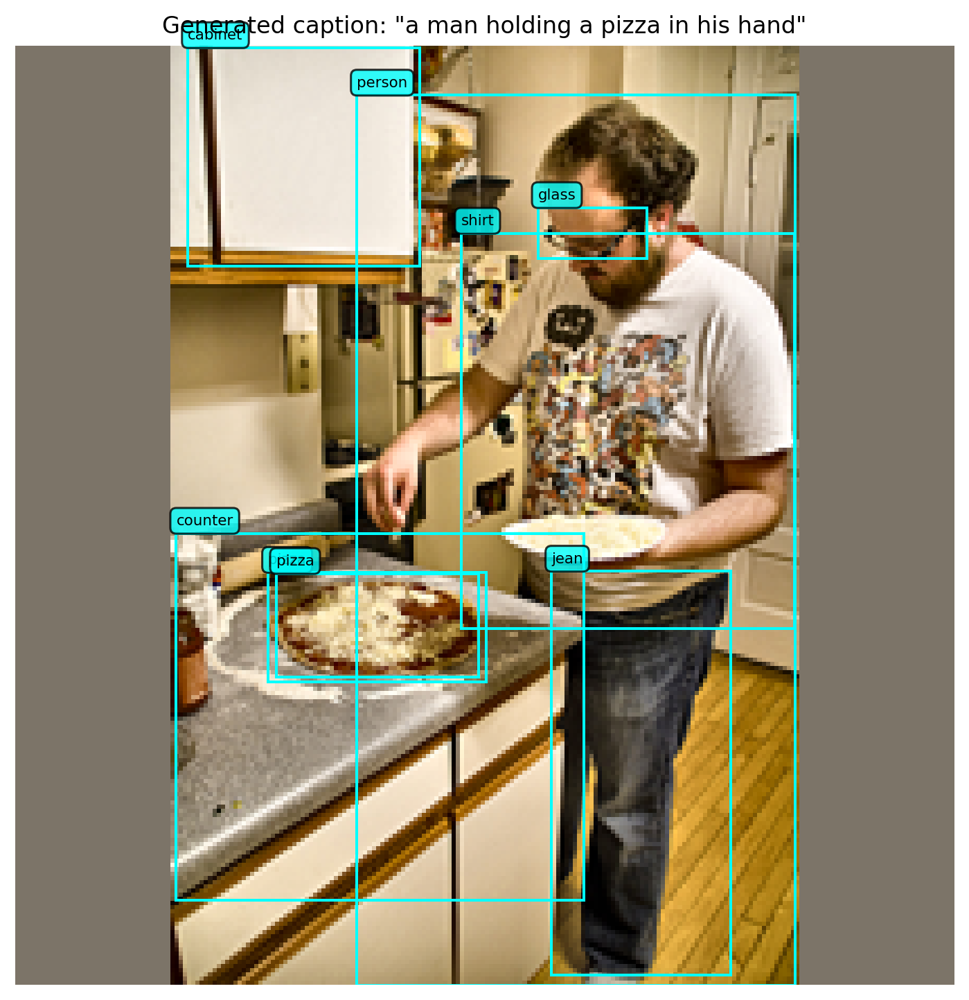


    Pipeline caption : "a man holding a pizza in his hand"
    Human reference  : "The man is making a cheese pizza in his kitchen."


So it's not very good, but I still am happy with it: at least something passable comes out of it.


```python

```

## 14. Conclusions

### Findings

The original research question was: **does giving a caption decoder an explicit
scene-graph (objects plus `subject → predicate → object` relationships) produce
better captions than the same decoder working from pixels alone?** To answer it
we built a complete pipeline on Visual Genome: a cleaned, COCO-caption-joined
dataset of ~44k images; classical CV preprocessing with box-synchronised
augmentation; a from-scratch Transformer caption decoder; a scene-graph encoder;
a fine-tuned YOLO detector; and a GNN relationship predictor, and a transformer
decoder based captioner.

What we found was:

1. A ground-truth scene graph *does* help, modestly but consistently. With an
otherwise identical architecture and training budget, Model A trained on the
ground-truth graph beat the image-only baseline on every caption metric.The
gains are small (~1.5–1.7 points) but consistent across these very different
metrics.

2. Model B, using it's predicted scene graph, has about equal performance in NLP
metrics to the image-only captioner. This illustrates the weakness of
independantly trained models in what should be a single pipeline. What we gain
in modularity, we lose in fragility of the individual components.

3. The classical CV preprocessing steps did not measurably help (or hurt), at
least to the best of my understanding. The small 2x2 experiment might have been
insufficient as a proper scientific investigation, but it also taught me to not
assume 'best practices' but to experiment and get hard data for even industry
standard 'common sense'.

### Next Steps

- Train YOLO harder - To train 35000 images for 50 epochs, it took me a
whole night. This is not counting all the other attempts and hyperparameter
adjustments, that was just for the 'final' pass. In an improved - version of
Model B I'd fine-tune YOLO on a larger set of images (perhaps the entire Visual
Genome corpus), with a larger YOLO variant, and for more epochs.
- Joint training of Model B - As mentioned earlier, for model B, all three
stages are trained independantly. I believe having gradients flow through all
the layers in a single pass would allow the downstream errors to be corrected
upstream 'at the source', and so would produce a more coherent result.
- Unfreeze more layers of the backbone - As of now, ResNet50 is used almost
fully frozen. With more computational resources, I would investigate unfreezing
some more layers and letting them fine-tune on our data.
- Larger Transformer Decoder - I mentioned earlier that I had experimented
with T5 and Bert, but stopped after finding them both kind of hard to work with
on my meager computer. A clear upgrade to this would be to use one of those larger
pre-trained models as the backbone to our Caption Decoder.

## 15. References

1. Krishna, R. et al. (2017). *Visual Genome: Connecting Language and Vision
   Using Crowdsourced Dense Image Annotations.* International Journal of
   Computer Vision, 123(1), 32–73.
2. Xu, D., Zhu, Y., Choy, C. B., & Fei-Fei, L. (2017). *Scene Graph Generation
   by Iterative Message Passing.* CVPR. (The "VG150" 150-object / 50-predicate
   split.)
3. Neau, M. et al. (2023). *Fine-Grained is Too Coarse: A Novel Data-Centric
   Approach for Efficient Scene Graph Generation.* ICCV 2023 Workshop (SG2RL);
   arXiv:2305.18668. (The VG-curated annotations used here.)
4. Lin, T.-Y. et al. (2014). *Microsoft COCO: Common Objects in Context.* ECCV.
   (Source of the training captions.)
5. Vaswani, A. et al. (2017). *Attention Is All You Need.* NeurIPS. (The
   Transformer encoder/decoder.)
6. He, K., Zhang, X., Ren, S., & Sun, J. (2016). *Deep Residual Learning for
   Image Recognition.* CVPR. (The ResNet-50 image backbone.)
7. Jocher, G. et al. (2023). *Ultralytics YOLO.* (The object detector
   fine-tuned in Stage 1.)
8. Hamilton, W. L., Ying, R., & Leskovec, J. (2017). *Inductive Representation
   Learning on Large Graphs (GraphSAGE).* NeurIPS. (Message-passing GNN design.)
9. Papineni, K. et al. (2002). *BLEU: a Method for Automatic Evaluation of
   Machine Translation.* ACL.
10. Banerjee, S. & Lavie, A. (2005). *METEOR: An Automatic Metric for MT
    Evaluation with Improved Correlation with Human Judgments.* ACL Workshop.
